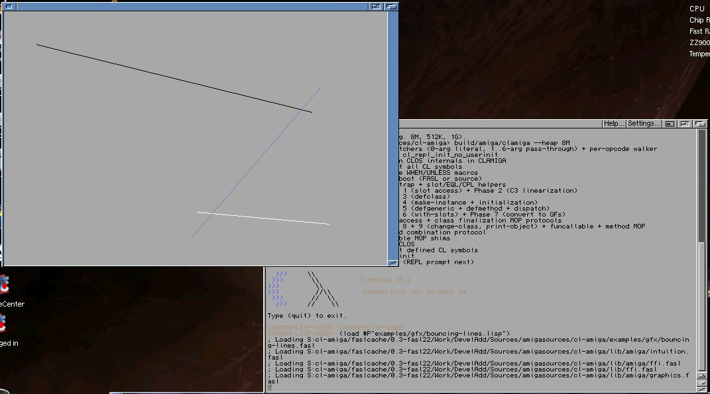
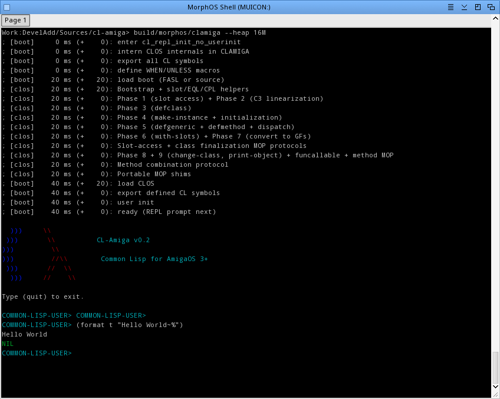

# CL-Amiga (Clamiga)

[](https://github.com/mdbergmann/cl-amiga/actions/workflows/ci.yml)

A Common Lisp implementation for AmigaOS 3+, targeting 68020+ processors.

> **Alpha software** — CL-Amiga is under active development. The core language is functional and can run real-world CL libraries, but ANSI CL compliance is incomplete and APIs may change. See [Known Limitations](#known-limitations-and-future-work) for details.

CL-Amiga is a bytecode-compiled Common Lisp environment written in C (C89/C99). It aims for ANSI Common Lisp compatibility and runs on classic Amiga hardware (or emulators like FS-UAE) as well as modern POSIX hosts (macOS, Linux).

## Why CL-Amiga?

There are already excellent Common Lisp implementations — SBCL, CCL, ECL, Clasp, CLISP — so why another one?

**Because none of them run on the Amiga** — neither the classic 68k machines nor the PPC-based next-gen systems (MorphOS, AmigaOS 4). The high-performance implementations (SBCL, CCL) are native-code compilers tied to modern architectures — x86-64, ARM, PPC — with no 68k backend and a memory footprint measured in tens of megabytes. Clasp is built on LLVM and targets C++ interop. CLISP, the closest in spirit — a compact bytecode interpreter in C — hasn't had a maintained AmigaOS build in decades.

CL-Amiga is built for the constraint the others ignore: **a 68020 at 14 MHz with 8 MB of RAM.** It's a self-contained bytecode VM in portable C89/C99 with no external runtime dependencies — no libffi (there's a hand-written 68k trampoline), no LLVM, no C compiler needed at runtime. Values are 32-bit tagged words and heap pointers are arena-relative offsets, keeping the whole object model 32-bit-clean; a compacting GC keeps a small heap from fragmenting, and on real 68k hardware there's an optional native JIT. Yet it's ambitious enough on the language side to load ASDF, run Quicklisp, and pass the self-tests of real libraries (Alexandria, FSet, fiveam, Sento) — and it runs identically on a modern macOS/Linux host, where most development actually happens.

Because execution is bytecode, the object model is **architecture-agnostic**: the same compiled Lisp runs unchanged on 68k and PowerPC. The primary, fully-working target is classic **AmigaOS 3+** on 68020+; a **native MorphOS (PPC)** build is in progress, and **AmigaOS 4** — the other PPC-based next-gen system — is a natural target on the same path. So while the design's tightest constraint is the classic Amiga, the aim is the whole Amiga family, not just the 68k machines.

In short: it exists to bring a modern, ANSI-aiming, library-capable Common Lisp to hardware every other implementation left behind — without giving up comfortable development on a fast host.

### The name

**CL-Amiga** is simply *Common Lisp for the Amiga*. Say it out loud and it becomes **Clamiga** — and *amiga* is Spanish/Portuguese for a (female) friend. So the name does double duty: the Lisp that runs on your Amiga, and the Lisp that's your *amiga*. 🙂

### How it compares

| Implementation | Approach | Amiga family (68k / PPC)? | Footprint | Notes |
|---|---|---|---|---|
| **CL-Amiga** | Bytecode VM in C, optional m68k JIT | **Yes** — its whole reason to exist (68k now; MorphOS/OS4 PPC in progress) | Tiny (runs in 8 MB) | Alpha; ANSI coverage incomplete |
| **ECL** | Lisp → C, bytecode fallback | No | Medium | Very portable/embeddable on modern hosts |
| **CCL** | Native compiler | No (x86-64/ARM/PPC only) | Large | Fast and mature; no 68k backend |
| **Clasp** | LLVM-based, C++ interop | No | Very large (needs LLVM) | Best for C++/scientific interop |
| **SBCL** | Native compiler | No | Large | Fastest mainstream CL; modern arch only |
| **CLISP** | Bytecode interpreter in C | Historically, now unmaintained | Small | Closest in spirit; no current Amiga build |

**Pros:** runs where nothing else does; tiny and dependency-free; identical behavior on host and Amiga; small, readable C you can actually hack on.
**Cons:** alpha-quality ANSI coverage; a bytecode VM with a light JIT won't match a native compiler's raw speed; the object model is 32-bit throughout, so even on a 64-bit host the heap is capped at 4 GB (a deliberate trade for a compact, Amiga-faithful representation); the ecosystem is (so far) an ecosystem of one.

## Status

CL-Amiga can load **ASDF**, install and run **Quicklisp**, and successfully quickload libraries including **Alexandria**, **fiveam**, **FSet**, and **Sento** — their `asdf:test-system` suites pass end-to-end. Sento pulls in **lparallel**, **serapeum**, **bordeaux-threads**, **log4cl** and friends along the way.

**ANSI conformance** — the Paul Dietz ANSI test suite (`third_party/ansi-test/`) is the working spec. A bootstrap in `trunk/` runs it on host and Amiga:

- **CONS, SYMBOLS, NUMBERS, and SEQUENCES** (`load-and-test-ansi.lisp`) — passing.

A broad test suite covers the implementation, including threading, CLOS, conditions, the full numeric tower, FFI, the m68k JIT, and AmigaOS GUI (Intuition/Graphics/GadTools).

### Screenshots

| AmigaOS 3 | MorphOS |
|---|---|
|  |  |

## Building

### Host (macOS / Linux)

```
make host          # Build for host (gcc)
make test          # Fast test tier (C unit + shell tests)
make test-plus     # Fast tier + host-cold-test (sento cold-load smoke test)
make test-extra    # Heavyweight trunk integration scripts
make clean         # Remove build artifacts
```

### Pre-commit hook (auto-review + tests)

Optional. A `pre-commit` hook reviews staged changes with a headless `claude`
(auto-fixing issues and re-staging), then runs the fast test tier
(`make test-fast` — no sento) and blocks the commit on failure. Activate once
per clone:

```
make install-hooks
```

Bypass a single commit with `git commit --no-verify`. See
[`scripts/review/README.md`](scripts/review/README.md) for the full flow,
toggles, and safety guarantees.

(For building the AmigaOS binary, see [Building for AmigaOS](#building-for-amigaos) below.)

## Usage

```
./clamiga                      # Start REPL
./clamiga --load hello.lisp    # Same as above
./clamiga --heap 8M            # Start with 8 MB heap
```

### Version

From Lisp, on any platform:

```lisp
(lisp-implementation-type)     ; => "CL-Amiga"
(lisp-implementation-version)  ; => "0.3.0"
```

On AmigaOS the binary also carries a standard `$VER:` cookie, so the Shell's
`Version` command works without starting the REPL:

```
1> Version clamiga
clamiga 0.3 (09.07.2026)
```

See `tests/test_version.c` for the full contract.

### Heap and stack sizing

The default heap is **4 MB**. Larger workloads need more:

| Use case                        | Heap             | Amiga stack       |
|---------------------------------|------------------|-------------------|
| REPL / small programs           | 4M (default)     | 64K (default)     |
| Loading ASDF                    | `--heap 11M`     | 64K (default)     |
| Quicklisp + quickload libraries | `--heap 24M`     | `stack 128000`    |
| FSet (functional collections)   | `--heap 24M`     | `stack 128000`    |
| Fiveam (load + self-tests)      | `--heap 24M`     | `stack 128000`    |

On AmigaOS, the default 64K stack is sufficient for basic use. For Quicklisp/ASDF workloads with deep CLOS dispatch chains, increase the stack:

```
stack 400000
clamiga --heap 24M
```

### Quicklisp

Quicklisp runs on CL-Amiga, but the stock client doesn't recognise this implementation and pulls in libraries that assume features we don't have yet. So the project ships a small compat layer, a set of **library backends** — maintained forks of a few systems that now carry first-class CL-Amiga support behind `#+cl-amiga` / `#+clamiga` branches — and a tiny `swank` stub, and keeps the bootstrap entirely on its own side. The library forks are deliberately minimal and exist to be upstreamed once the remaining API gaps close.

**Installing Quicklisp on a fresh system** (where `~/quicklisp/` — Amiga: `S:quicklisp/` — does not exist yet). Do this once:

```lisp
(require "asdf")
(load "lib/quicklisp-install.lisp")
(cl-amiga-ql:install)                 ; downloads + installs the QL client, patches networking
```

`cl-amiga-ql:install` runs the standard `quicklisp-quickstart:install`, catches the network error it raises (CL-Amiga isn't a registered `ql-impl` yet), loads the compat shim so networking works, and retries the dist install. Two more things need to be on disk in `~/quicklisp/local-projects` (Amiga: `S:quicklisp/local-projects`): the `swank` stub — run `make install-shims` once from the repo root to symlink it in — and the CL-Amiga **library forks** (listed below), which you install by cloning them into that directory. Quicklisp's local-projects searcher then resolves both ahead of the stock dist releases.

**Using Quicklisp** in any later session, once it is installed:

```lisp
(load #P"~/quicklisp/setup.lisp")
(load "lib/quicklisp-compat.lisp")
(ql:quickload "alexandria")
```

**What we patch** (the local changes shipped with the project):

- `lib/quicklisp-compat.lisp` — routes Quicklisp's networking through `ext:open-tcp-stream` and plain CL stream ops (working around generic-function dispatch limits in the stock `ql-network` interface), adapts `directory-entries` to CL-Amiga's `directory`, and maps the bordeaux-threads v2 surface onto the `MP` package.
- **CL-Amiga library forks** (cloned into `~/quicklisp/local-projects`) — maintained forks that carry first-class CL-Amiga support behind `#+cl-amiga` / `#+clamiga` branches, so a stock `quickload` resolves them like any other implementation backend rather than needing a replacement package. See the [Library forks (CL-Amiga backends)](#library-forks-cl-amiga-backends) table below for the full list.
- `contrib/shims/swank` (installed by `make install-shims`) — a tiny stub package: several libraries such as clack name the `swank` system only to reach a couple of symbols for an optional remote-debug server they never start. It stays a shim (there is no upstream to fork) and resolves via Quicklisp's local-projects searcher.
- `lib/asdf.lisp` — `#+cl-amiga` adaptations: real binary FASL compile/load for cross-session persistence, AmigaOS path/device handling, and `*asdf-session*` NULL-safety.

Libraries confirmed working via `quickload` + `asdf:test-system` (`trunk/run-load-and-test-all.sh`) include **fiveam**, **FSet**, **cl-spark**, **str**, **closer-mop**, **CFFI**, **chipi** (cl-hab), and **Sento** — plus, on the host, the **drakma** HTTP/HTTPS client and the **Hunchentoot** web server (these two need a TCP/IP stack; see [Integration test scripts](#integration-test-scripts)). Loading these pulls in and exercises a much wider dependency graph along the way — **alexandria, serapeum, lparallel, log4cl, bordeaux-threads, cl+ssl, usocket, chipz, cl-who** and friends. Sento cold-compiles its full dependency tree, so give it ~96–128M of heap (more for a cold cache) and `stack 800000` on Amiga.

### Ocicl

[Ocicl](https://github.com/ocicl/ocicl) is an alternative to Quicklisp that distributes ASDF systems as OCI artifacts pulled from a container registry. It has two halves: the `ocicl` command-line tool, which fetches systems over HTTPS into a project-local `systems/` directory, and a runtime hook that teaches ASDF where to find them. CL-Amiga consumes the second half directly — once the systems are on disk, an `ocicl`-managed `systems/` tree is just `.asd` files plus sources, which CL-Amiga's ASDF loads like any other source registry.

**Install the systems with the host `ocicl` tool.** Run the upstream CLI (on the macOS/Linux host, or anywhere you have it) from your project directory to vendor the systems you need:

```sh
cd my-project
ocicl install alexandria       # downloads into ./systems/ and records ./systems.csv
```

This populates a `systems/` subdirectory and a `systems.csv` manifest inside the project.

**Point ASDF at the tree from `.clamigarc`.** CL-Amiga reads `~/.clamigarc` (Amiga: `S:.clamigarc`) at startup, so add an `asdf:initialize-source-registry` form there to register the project's `systems/` directory as a search tree. ASDF requires `:tree`/`:directory` pathnames to be **absolute**, so merge the relative subdirectory against `*default-pathname-defaults*` (seeded with the current working directory) rather than passing a bare relative `#P"systems/"`:

```lisp
(require "asdf")
(asdf:initialize-source-registry
  `(:source-registry
    (:tree ,(merge-pathnames "systems/" *default-pathname-defaults*))
    :inherit-configuration))
```

(Note the backquote and `,` — the form is built with a computed absolute pathname, not quoted literally.) If the project doesn't live at the directory clamiga is launched from, use the `:home` token (resolved against your home directory regardless of the cwd) or a plain absolute pathname instead:

```lisp
(asdf:initialize-source-registry
  '(:source-registry
    (:tree (:home "my-project/systems/"))
    :inherit-configuration))
```

`ocicl` sometimes vendors into `ocicl/` rather than `systems/`; list both as separate `:tree` entries (earlier entries win on name clashes) so either layout is picked up:

```lisp
(asdf:initialize-source-registry
  `(:source-registry
    (:tree ,(merge-pathnames "systems/" *default-pathname-defaults*))
    (:tree ,(merge-pathnames "ocicl/"   *default-pathname-defaults*))
    :inherit-configuration))
```

After that, `(asdf:load-system "alexandria")` resolves against the `ocicl`-installed copy. Because this is plain ASDF, the CL-Amiga library forks listed below still apply — clone any needed `*-clamiga.lisp` fork into a directory covered by the source registry so it takes precedence over the stock system.

> CL-Amiga does not yet run the `ocicl` fetcher natively (that needs an on-Amiga OCI-registry client); install on the host and copy or share the `systems/` tree to the Amiga side.

### Library forks (CL-Amiga backends)

Several third-party libraries don't recognise CL-Amiga and either lack a porting
layer for it or assume features of other implementations. For these, the project
maintains forks that add a CL-Amiga backend (a new `*-clamiga.lisp` file) or a
small `#+cl-amiga` / `#+clamiga` adaptation. Clone them into
`~/quicklisp/local-projects/` (Amiga: `S:quicklisp/local-projects/`) so
Quicklisp's local-projects searcher picks them up ahead of the stock dist
versions. The goal is to upstream each one as the remaining API gaps close.

| Library | Fork repository | What the CL-Amiga support adds |
|---------|-----------------|--------------------------------|
| **usocket** | https://github.com/mdbergmann/usocket | `backend/clamiga.lisp` — a usocket backend that wraps CL-Amiga's `EXT`-package TCP sockets/streams. The networking foundation for drakma and Hunchentoot. |
| **bordeaux-threads** | https://github.com/mdbergmann/bordeaux-threads | `apiv1/impl-clamiga.lisp` + `apiv2/impl-clamiga.lisp` — maps the BT v1 and v2 thread/lock/condition-variable surface onto CL-Amiga's `MP` package. Pulled in by Sento, lparallel, and most concurrent libraries. |
| **cffi** | https://github.com/mdbergmann/cffi | `src/cffi-clamiga.lisp` — a CFFI-SYS backend built on CL-Amiga's `FFI` package (fully functional on the POSIX host; AmigaOS uses the library-vector model). Lets CFFI-dependent systems load. |
| **trivial-features** | https://github.com/mdbergmann/trivial-features | `src/tf-clamiga.lisp` — populates `*features*` with CL-Amiga's OS/CPU/endianness keywords. Required by CFFI and cl+ssl for platform detection. |
| **closer-mop** | https://codeberg.org/mdbergmann/closer-mop | `#+clamiga` package definition plus a `closer-clamiga.lisp` backend that re-export CL-Amiga's native AMOP subset under the CLOSER-MOP / C2MOP / C2CL names. |
| **trivial-cltl2** | https://github.com/mdbergmann/trivial-cltl2 | `clamiga.lisp` backend supplying the CLtL2 functions serapeum/trivia call (`declaration-information`, `variable-information`, `function-information`, `compiler-let`, `parse-macro` / `enclose`). |
| **introspect-environment** | https://github.com/mdbergmann/introspect-environment | `#+cl-amiga` `typexpand` / `typexpand-1` built on CL-Amiga's deftype expander table (`clamiga::%type-expander`), so callers like serapeum's `explode-type` can resolve user `deftype` aliases. |
| **trivial-garbage** | https://github.com/mdbergmann/trivial-garbage | `#+cl-amiga` finalizers and weak pointers, with weak hash-tables falling back to ordinary (strong) tables. |
| **chipz** | https://github.com/mdbergmann/chipz | `#+cl-amiga` Gray-stream branch in `stream.lisp` — makes `make-decompressing-stream` work. Enables drakma's gzip/deflate `:decode-content`. |
| **float-features** | https://codeberg.org/mdbergmann/float-features | `#+cl-amiga` branch using CL-Amiga's IEEE float-bits builtins (`clamiga:single-float-bits`, …). Needed by jzon to serialize floats (e.g. chipi-api's SSE JSON). |
| **rfc2388** | https://github.com/mdbergmann/rfc2388 | `#+cl-amiga` MIME multipart parsing using a `:latin-1` external format. Used by Hunchentoot for multipart form/file uploads. |
| **cl-fad** | https://github.com/mdbergmann/cl-fad | `#+:cl-amiga` directory/pathname/file utilities (`list-directory`, `file-exists-p`, …) mapped onto CL-Amiga's `directory`/`probe-file`. Used by Hunchentoot. |
| **hunchentoot** | https://github.com/mdbergmann/hunchentoot | `#+:cl-amiga` web-server adaptations (e.g. `set-timeouts` over the usocket clamiga backend). Runs CL-Amiga as an HTTP server. |
| **atomics** | https://codeberg.org/mdbergmann/atomics | `#+clamiga` compare-and-swap / atomic-op branch in `atomics.lisp`. Backs bordeaux-threads v2's atomic API. |
| **fset** | https://github.com/mdbergmann/fset | `#+cl-amiga` branches in `Code/port.lisp` (lock/memory-barrier stubs onto the `MP` package, a `make-char` helper). The functional-collections library; its own suite passes 17/17 on CL-Amiga. |

> **fset dependency:** fset 2.4.x requires `misc-extensions` ≥ 4.2.4, which is
> newer than the version in the bundled Quicklisp dist. Clone the upstream
> [slburson/misc-extensions](https://github.com/slburson/misc-extensions) (≥ 4.2.4)
> into `~/quicklisp/local-projects/` as well — it needs no CL-Amiga patch and
> loads as-is, but the local-projects copy must take precedence over the older dist
> release for fset to build.

### Integration test scripts

Reusable Lisp loaders in `trunk/` that load and exercise third-party libraries on both host and Amiga:

```
./build/host/clamiga --heap 24M  --load trunk/load-and-test-alexandria.lisp     # Alexandria (250/250)
./build/host/clamiga --heap 24M  --load trunk/load-and-test-5am.lisp            # Fiveam
./build/host/clamiga --heap 24M  --load trunk/load-and-test-fset.lisp           # FSet
./build/host/clamiga --heap 64M  --load trunk/load-and-test-trivia.lisp         # Trivia pattern matcher (490/490)
./build/host/clamiga --heap 24M  --load trunk/load-and-test-cl-spark.lisp       # cl-spark (sparklines, 68/68)
./build/host/clamiga --heap 64M  --load trunk/load-and-test-str.lisp            # str
./build/host/clamiga --heap 192M --load trunk/load-and-test-sento-system.lisp   # Sento (cold cache)
./build/host/clamiga --heap 192M --load trunk/load-and-test-knx-conn.lisp       # knx-conn KNXnet/IP (fiveam)
./build/host/clamiga --heap 96M  --load trunk/load-and-test-ansi.lisp           # ANSI cons + symbols + numbers
./build/host/clamiga --heap 256M --load trunk/load-and-test-cffi.lisp           # CFFI backend
./build/host/clamiga --heap 256M --load trunk/load-and-test-drakma.lisp         # drakma HTTP/HTTPS (host only)
./build/host/clamiga --heap 256M --load trunk/load-and-test-hunchentoot.lisp    # Hunchentoot server (host only)
./build/host/clamiga --heap 256M --load trunk/load-and-test-chipi-api.lisp      # chipi web API tests (host only)
./build/host/clamiga --heap 256M --load trunk/load-and-test-chipi-ui.lisp       # chipi-ui CLOG UI tests (host only)
```

`load-and-test-drakma.lisp` drives **drakma** as an HTTP/HTTPS **client** and
runs drakma's own test suite: plain HTTP and HTTPS, GET and POST, streamed and
gzip-decoded responses, and cl+ssl certificate verification. It loads over the
**usocket** cl-amiga backend, with **cl+ssl** against the host's OpenSSL and the
**chipz** fork for decompression.

`load-and-test-hunchentoot.lisp` runs cl-amiga itself as a web **server**: it
starts a Hunchentoot `easy-acceptor` and runs Hunchentoot's built-in confidence
suite against it (driving drakma over loopback through cookies, sessions,
multipart parameters, redirection and basic auth), rendering HTML with
**cl-who**.

Both scripts are **host-only** — they need a TCP/IP stack and network access,
which the Amiga/FS-UAE test harness lacks.

### Loading source and FASL files

CL-Amiga ships a bytecode VM, so `compile-file` writes a `.fasl` and `load` can take either a `.lisp` source or a precompiled `.fasl`.

| Call                       | Behaviour                                                                                                                                                                                  |
|----------------------------|--------------------------------------------------------------------------------------------------------------------------------------------------------------------------------------------|
| `(load "x.lisp")`          | Looks up a cached FASL in the per-user cache (see below) and loads it if its mtime ≥ the source. Otherwise loads the source and **auto-writes** a fresh FASL to the cache for next time.   |
| `(load "x.fasl")`          | Loads that exact file. The per-user cache is **not** consulted — `.fasl` inputs are already-compiled artifacts.                                                                            |
| `(require "name")`         | Searches `lib/name.fasl` and `lib/name.lisp` (and `PROGDIR:lib/...` on Amiga) and picks the FASL when its mtime ≥ source. Used internally for `clos`, `asdf`, etc.                         |
| `(compile-file "x.lisp")`  | Writes to the cache path (= what `compile-file-pathname` returns). `:output-file "x.fasl"` overrides.                                                                                      |

When a literal object reachable from compiled code is an instance of a class that defines a `make-load-form` method (CLHS 7.6), `compile-file` serializes the object as that method's creation + initialization forms and reconstructs it via those forms at load time, instead of dumping it slot-for-slot. `make-load-form-saving-slots` is provided, and the reconstructed object preserves a slot that points back at itself (the circular self-reference). Plain structures with no method keep the built-in fast path. See `tests/test_make_load_form.sh` (host) and the MAKE-LOAD-FORM cases in `tests/amiga/run-tests.lisp` (Amiga) for runnable examples.

**Per-user cache locations** (keyed by `clamiga` version + FASL format version, so a version bump invalidates everything automatically):

- POSIX: `~/.cache/common-lisp/cl-amiga-<version>-fasl<n>/<source-path>.fasl`
- AmigaOS: `S:cl-amiga/faslcache/<version>-fasl<n>/<source-path>.fasl`

Pre-built `lib/boot.fasl` and `lib/clos.fasl` ship with the binary; on the lower-end 020 baseline this cuts cold boot from ~92 s to ~9 s. To regenerate them after editing `lib/*.lisp`:

```
./build/host/clamiga --non-interactive \
    --eval '(compile-file "lib/boot.lisp" :output-file "lib/boot.fasl")' \
    --eval '(compile-file "lib/clos.lisp" :output-file "lib/clos.fasl")'
```

Note: string literals in `lib/*.lisp` must stay ASCII-only — the Amiga build is compiled without `CL_WIDE_STRINGS` to save RAM and cannot read host FASLs that contain `FASL_TAG_WIDE_STRING`. The writer auto-downgrades all-ASCII wide strings to byte strings; non-ASCII chars in source string literals will fail Amiga boot with a `BAD_TAG` deserialize error. Comments are unaffected.

## Host FFI (dlopen + libffi + CFFI)

The `FFI` package provides foreign pointers and typed peek/poke on **all**
platforms (on AmigaOS the `AMIGA` package adds register-based library calls — see
[Raw FFI Access](#raw-ffi-access)). On the POSIX dev host the `FFI` package
additionally provides a real, general-purpose foreign-function engine — dynamic
library loading (`ffi:load-library`/`ffi:symbol-pointer` via `dlopen`/`dlsym`),
arbitrary C calls with full argument/return marshaling (`ffi:call-foreign`,
libffi-backed, incl. variadics), Lisp-as-C callbacks (`ffi:make-callback`, libffi
closures), and typed memory access
(`ffi:peek-i8/i16/i32/u64/i64/single/double/pointer` and the matching `poke-*`).

```lisp
;; Resolve and call libc directly
(ffi:call-foreign (ffi:symbol-pointer "pow") :double '(:double :double) '(2d0 10d0))
;; => 1024.0d0
```

On top of this engine cl-amiga ships a **CFFI** backend (`cffi-clamiga.lisp`,
in the CFFI source tree), so the standard CFFI API — `defcfun`,
`foreign-funcall`, `mem-ref`, `defcallback`, `defcstruct`, foreign strings —
works on the host. This is what lets CFFI-dependent Quicklisp systems load.
Foreign calls/callbacks are host-only; on AmigaOS use the library-vector model
(`AMIGA.FFI`) instead. See `tests/test_ffi.c` and
`trunk/load-and-test-cffi.lisp` for runnable end-to-end examples.

## Emacs (SLY) integration

CL-Amiga speaks the SLYNK protocol, so you can drive it from Emacs with [SLY](https://github.com/joaotavora/sly) — REPL, completion, `M-.`, the inspector, and the SLDB debugger. This targets the **host** build (`build/host/clamiga`) and needs a SLY checkout whose `slynk/backend/` includes the CL-Amiga backend (`clamiga.lisp`).

clamiga comes up exactly like every other implementation — there is no clamiga-specific Lisp startup file or init form. The backend (`slynk/backend/clamiga.lisp`) pulls in clamiga's Gray streams itself via `(require "gray-streams")`, which needs to locate the bundled `lib/`.

clamiga finds `lib/` in two ways: relative to the current working directory (so running it from the source root just works), and — failing that — under **`$CLAMIGA_HOME`** (on AmigaOS the equivalent is `PROGDIR:`, the executable's own directory). Setting `CLAMIGA_HOME` is the better choice for editor integration: it frees clamiga's working directory to follow the file buffer you launch from (so `sly-pwd` matches the source you're editing, like other implementations), instead of being pinned to clamiga's source root by SLY's `:directory`.

> **Heap sizing:** the 4 MB default thrashes the GC once SLYNK and its contribs load. Use **`--heap 96M` as a practical minimum** — that also carries a real application's dependency graph (e.g. `(asdf:load-system :sento)`). Give more headroom (`512M`) if you can.

### Method A — auto-start with `M-x sly` (recommended)

Add a `clamiga` entry to `sly-lisp-implementations`. Point clamiga at its `lib/` with `CLAMIGA_HOME` rather than SLY's `:directory`, so the connection's working directory follows the buffer you start from instead of being forced to the source root:

```elisp
(defvar my/clamiga-root "/path/to/cl-amiga")
(defvar my/clamiga-bin  (expand-file-name "build/host/clamiga" my/clamiga-root))

;; Let the backend's (require "gray-streams") find lib/ no matter the cwd,
;; while leaving the cwd (sly-pwd) free to track the file buffer.
(setenv "CLAMIGA_HOME" my/clamiga-root)

(with-eval-after-load 'sly
  (add-to-list 'sly-lisp-implementations
               `(clamiga (,my/clamiga-bin "--heap" "512M"))))
```

(If you prefer the old behaviour of pinning the working directory to the source root, drop the `setenv` and add `:directory ,my/clamiga-root` back to the entry instead.)

Then `M-x sly` and pick `clamiga` (or `C-u M-x sly` to choose). SLY starts a server on an OS-assigned port (via ASDF + `slynk.asd`, which includes the CL-Amiga backend) and connects automatically.

### Method B — external server + `M-x sly-connect`

Start a server in a terminal, then connect to it (useful to keep the image alive across reconnects). A launcher ships with cl-amiga:

```sh
# From the cl-amiga repo root:
SLY_SLYNK_DIR=/path/to/sly/slynk \
  ./tools/sly/clamiga-slynk.sh                 # defaults: port 4005, heap 96M
# CLAMIGA_PORT=4006 and a trailing `--heap 192M' etc. also work.
```

It runs clamiga from the source root (so Gray streams resolve), loads `slynk-loader`, starts a server on the chosen port, and holds stdin open with `tail -f /dev/null` (otherwise the REPL reads EOF and exits, taking the server thread with it). Then in Emacs:

```
M-x sly-connect RET 127.0.0.1 RET 4005 RET
```

The equivalent by hand, without the script:

```sh
cd /path/to/cl-amiga
tail -f /dev/null | ./build/host/clamiga --heap 96M \
    --eval '(load "/path/to/sly/slynk/slynk-loader.lisp")' \
    --eval '(funcall (read-from-string "slynk-loader:init"))' \
    --eval '(funcall (read-from-string "slynk:create-server") :port 4005 :dont-close t)'
```

## ICL integration

[ICL](https://github.com/atgreen/icl) (Interactive Common Lisp) is a terminal/browser REPL frontend that drives an inferior Lisp over the SLYNK protocol — the same protocol CL-Amiga already speaks for SLY, so clamiga works as an ICL backend. Register it in `~/.iclrc`:

```lisp
;; Let clamiga's (require ...) find its bundled lib/ from any directory.
(setf (uiop:getenv "CLAMIGA_HOME") "/path/to/cl-amiga")

;; ICL must load a SLYNK whose slynk/backend/ includes clamiga.lisp —
;; point it at your SLY checkout (trailing slash required).
(setf (uiop:getenv "ICL_SLYNK_PATH") "/path/to/sly/slynk/")

(icl:configure-lisp :clamiga
  :program "/path/to/cl-amiga/build/host/clamiga"
  :args '("--heap" "96M"))
```

Then run `icl --lisp clamiga`. ICL spawns clamiga, loads SLYNK via ASDF, and connects; evaluation, completion, `,doc`, the inspector, and the browser UI all run against the clamiga image.

## Package Reference

Beyond `COMMON-LISP` / `COMMON-LISP-USER`, CL-Amiga ships several packages for
platform extensions, threading, FFI, the Gray-streams protocol, the CLOS
Metaobject Protocol, and the AmigaOS GUI. `COMMON-LISP-USER` already `:use`s most
of them, so their symbols are usually available unqualified at the REPL. Each has
its own reference page under [`docs/`](docs/README.md):

| Package | What it provides | Doc |
|---------|------------------|-----|
| `EXT` | TCP sockets, GC control, environment access, terminal raw mode (TUIs), debug/introspection | [docs/ext.md](docs/ext.md) |
| `MP` | Threads, locks, condition variables, memory barriers | [docs/mp.md](docs/mp.md) |
| `FFI` | Foreign pointers, typed peek/poke, libffi calls & callbacks | [docs/ffi.md](docs/ffi.md) |
| `GRAY` | Gray-streams protocol (define stream classes in Lisp) | [docs/gray.md](docs/gray.md) |
| `MOP` | CLOS Metaobject Protocol (AMOP / closer-mop subset) | [docs/mop.md](docs/mop.md) |
| `CLAMIGA` | IEEE float bits, package-local nicknames, JIT/trace toggles | [docs/clamiga.md](docs/clamiga.md) |
| `AMIGA`, `AMIGA.*` | Raw library calls, FFI tag lists, Intuition, Graphics, GadTools | [docs/amiga.md](docs/amiga.md) |

The symbol lists in those pages are kept honest by `make docs-check`, which
diffs the real package exports against a committed snapshot; run
`make docs-update` after changing a package's exports. See
[docs/README.md](docs/README.md#keeping-the-lists-in-sync).

## Architecture

- **Single-pass compiler** from S-expressions to bytecode, executed by a stack-based VM
- **Tagged 32-bit values** (`CL_Obj = uint32_t`) — heap pointers are arena-relative byte offsets
- **Memory-efficient** — bump allocator with free-list fallback, mark-and-sweep GC with sliding compaction (auto-triggered when fragmentation blocks an allocation that a normal GC couldn't satisfy); designed for 68020 @ 14 MHz with 8 MB RAM
- **Platform abstraction** — all OS calls go through `platform.h` (POSIX and AmigaOS implementations)
- **FFI** — generic foreign pointer type + peek/poke (all platforms); 68k assembly trampoline for AmigaOS register-based library calls
- **Threading** (MP package) — kernel threads, per-thread dynamic bindings (TLV), locks, named condition variables, thread interruption/destruction, type predicates; stop-the-world GC with safepoints; POSIX pthreads (with `__thread`-backed TLS) and AmigaOS processes/SignalSemaphores
- **TCP networking** — BSD sockets (POSIX) and bsdsocket.library (AmigaOS). On the
  POSIX host the socket table grows on demand, so a server can hold thousands of
  simultaneous connections (readiness waits use `poll`, which has no `FD_SETSIZE`
  ceiling); on AmigaOS the table is a fixed 64 slots, bounded by bsdsocket.library's
  per-task descriptor table. Socket streams support per-connection read/write timeouts:
  `(setf (ext:socket-stream-timeout stream :input) seconds)` (also `:output`) arms a
  `poll`/`WaitSelect` deadline so a read/write that stalls past the timeout signals
  `ext:socket-timeout` (a subtype of `stream-error`) instead of blocking forever; the
  value is in seconds (fractional allowed), `nil` clears it, and reading the place back
  returns the current setting. See `tests/test_stream.c`
  (`platform_socket_table_grows_many_connections`, `socket_read_timeout_*`,
  `eval_socket_stream_timeout_*`) and `tests/amiga/run-tests.lisp` for usage.

### Declarations (`declaim` / `proclaim` / `declare`)

cl-amiga accepts the full ANSI declaration syntax so that portable code compiles
without error, but only a subset of declarations currently changes behavior. The
rest are parsed and accepted as conforming no-ops.

- **`declaim`** processes its specifiers at compile time *and* emits a
  `proclaim` call that runs whenever the form is executed — REPL, source load,
  or compiled-FASL load (per CLHS it behaves like `eval-when` with
  `:compile-toplevel :load-toplevel :execute`). So a library's
  `(declaim (optimize ...))` or `(declaim (special ...))` still takes global
  effect when its cached FASL is loaded, not only when it was compiled.
  **`proclaim`** is the plain runtime function form for the same specifiers —
  both apply globally. **`declare`** handles leading declarations in
  a body; `special` and `optimize` declarations are lexically scoped to that body
  (CLHS 3.3.4) and stop applying when it ends.
- **`special`** — *honored.* Marks the variable as dynamically bound (per-thread
  dynamic bindings / TLV). `declaim`/`proclaim` make it globally special; a local
  `(declare (special x))` is scoped to its binding form.
- **`optimize`** — *honored.* The qualities `speed`, `safety`, `space`, and
  `debug` are parsed (bare `quality` ≡ level 3; values clamped to 0–3; all
  default to 1). A `declaim`/`proclaim` sets the global baseline; a body
  `(declare (optimize ...))` overrides it for that body only.
  - At **`speed ≥ 1`** (the default) the compiler folds calls to pure fixnum
    builtins with constant arguments (`+ - * 1+ 1- ash logand logior logxor
    not null = < > <= >=`) into a single constant load, and eliminates the
    dead branch of an `if` whose test is a compile-time constant (this also
    collapses `when`/`unless`/`and`/`or` with constant operands). Folding is
    value-transparent: anything that would overflow fixnum range or involve
    floats/ratios is left to the runtime. `(optimize (speed 0))` disables both.
  - At **`safety 0`** the `(the type value)` runtime check (`OP_ASSERT_TYPE`)
    and the `destructuring-bind` too-few/too-many arity guards are not emitted;
    at `safety ≥ 1` they are.
  - At **`speed ≥ 2`** a bytecode **peephole post-pass** runs over each
    compiled function: it removes store-then-reload round trips and discarded
    pure values, fuses `(not ...)` tests into inverted branches, threads
    jump-to-jump chains, and deletes unreachable code — typically 8–12%
    faster on load/store-heavy loops, and the m68k JIT compiles the optimized
    stream for free. The rewrite is semantics-preserving: type errors from
    discarded values (e.g. `(car 5)`), multiple-values state, and non-local
    exits all behave exactly as at `speed 0`.
  - `compilation-speed` is interned (so libraries can name
    `cl:compilation-speed`) but ignored, and any non-standard quality — e.g.
    `security` — is silently accepted and ignored.
- **`inline` / `notinline`** — `notinline` is *honored*: it suppresses
  compiler-macro expansion, constant folding, and the builtin-to-opcode
  inlining for the named functions, forcing real out-of-line calls.
  `inline` sets a flag on the function symbol (visible via `describe`) but
  does not yet force inlining of user functions.
- **`type`, `ftype`, `ignore`, `ignorable`, `dynamic-extent`** — accepted but
  currently no-ops (no type propagation, unused-variable warnings, or
  stack-allocation).

See `tests/test_optimize.c` and the "Optimize declarations" section of
`tests/amiga/run-tests.lisp` for runnable examples of the folding,
dead-branch, scoping, and check-elision behavior; the implementation lives in
`try_fold_constant`/`compile_if`/`compile_call` (`src/core/compiler.c`) and
`cl_process_declaration_specifier` (`src/core/compiler_extra.c`).

### The peephole post-pass in practice

**How it works**: when a function finishes compiling with an effective
`speed ≥ 2`, its bytecode is decoded into an instruction list, rewritten
(store-reload elimination, discarded-pure-value removal, `(not ...)` branch
fusion, jump threading, dead code), and re-encoded with all jump and
non-local-exit offsets recomputed. The pass is fail-safe: anything it does
not fully understand makes it leave the bytecode untouched, so it can never
miscompile — only miss an optimization.

**When it applies**: at **compile time only** — inside `defun`, `compile`,
`compile-file`, and source `load` — whenever the function's effective
`speed` is ≥ 2, whether that comes from a `declaim`/`proclaim` baseline, a
body `(declare (optimize (speed ...)))`, or the `CLAMIGA_FORCE_SPEED`
environment variable (which pins the effective `speed` for the whole
process, overriding declarations — handy for A/B testing any workload).

**FASL caches**: the optimization is baked into the compiled bytecode, so a
`.fasl` compiled at `speed 3` stays optimized for everyone who loads it,
regardless of their current settings. The flip side: **loading a cached FASL
never re-runs the compiler**, so code compiled at `speed 1` stays
unoptimized until it is actually recompiled — raising `speed` (or setting
`CLAMIGA_FORCE_SPEED=3`) afterwards has no effect on a warm cache. To push
an already-compiled library through the pass, clear its FASL cache first
(for ASDF/Quicklisp systems on the host: `~/.cache/common-lisp/cl-amiga-*`)
and reload.

`tests/test_peephole.c` demonstrates every rewrite pattern and guard, and
`tests/peephole-corpus.lisp` + `tests/test_peephole_diff.sh` run the same
code with the pass forced off and on (`CLAMIGA_FORCE_SPEED=0` vs `3`) and
require identical output. The design rationale and rewrite-soundness
arguments live in the `src/core/peephole.c` header comment and
`specs/performance.md` §1.8.

## Building for AmigaOS

### Cross-compile (m68k-amigaos-gcc)

Cross-compiling on a POSIX host is the **preferred** way to build the Amiga
binary — faster than compiling inside the emulator with vbcc.

First, install the `m68k-amigaos-gcc` cross toolchain:

```
./tools/setup-toolchain.sh          # auto-pick: download on macOS arm64, build elsewhere
./tools/setup-toolchain.sh --build   # force build-from-source on any host
./tools/setup-toolchain.sh --help    # all options
```

The toolchain itself is tracked as a git submodule
(`tools/m68k-amigaos-gcc` → [AmigaPorts/m68k-amigaos-gcc](https://github.com/AmigaPorts/m68k-amigaos-gcc),
pinned). On macOS arm64 the script downloads a prebuilt `prefix/` tarball
from the cl-amiga release; on every other host it runs `git submodule
update --init` and invokes the upstream `make all` (host build deps —
`gmp`, `mpfr`, `mpc`, `wget`, etc. — see `tools/m68k-amigaos-gcc/README.md`).

Then build CL-Amiga:

```
make -f Makefile.cross amiga        # Cross-compile with m68k-amigaos-gcc
make -f Makefile.cross test-amiga   # Build, deploy to FS-UAE, run Amiga tests
make -f Makefile.cross clean        # Remove cross-build artifacts
```

### Build inside AmigaOS (vbcc)

```
cd CLAmiga:
make -f Makefile.amiga
```

## AmigaOS Native GUI

CL-Amiga provides Lisp bindings for Intuition, Graphics, and GadTools — loaded on demand via `require` with zero binary size impact. A generic FFI layer (`FFI` package) provides foreign memory access on all platforms; the `AMIGA` package adds register-based library call dispatch via a 68k assembly trampoline.

### Opening a Window

```lisp
(require "amiga/intuition")
(require "amiga/graphics")

(amiga.intuition:with-window (win :title "Hello Amiga"
                                   :width 320 :height 200
                                   :idcmp (logior amiga.intuition:+idcmp-closewindow+
                                                  amiga.intuition:+idcmp-vanillakey+))
  (let ((rp (amiga.intuition:window-rastport win)))
    (amiga.gfx:set-a-pen rp 1)
    (amiga.gfx:move-to rp 20 40)
    (amiga.gfx:gfx-text rp "Hello from CL-Amiga!")
    (amiga.gfx:draw-line rp 20 50 300 50)
    ;; Wait for close gadget
    (amiga.intuition:event-loop win
      (#.amiga.intuition:+idcmp-closewindow+ (msg) (return)))))
```

### GadTools Gadgets

```lisp
(require "amiga/gadtools")

(amiga.intuition:with-pub-screen (scr)
  (amiga.gadtools:with-visual-info (vi scr)
    (amiga.gadtools:with-gadgets (glist ctx vi)
      (amiga.gadtools:create-gadget
        amiga.gadtools:+button-kind+ ctx vi
        :left 20 :top 30 :width 120 :height 16
        :text "Click Me" :gadget-id 1)
      (amiga.intuition:with-window (win :title "GadTools Demo"
                                         :width 320 :height 100
                                         :idcmp (logior amiga.intuition:+idcmp-closewindow+
                                                        amiga.gadtools:+buttonidcmp+))
        (amiga.intuition:add-gadget-list win
          (ffi:make-foreign-pointer (ffi:peek-u32 glist)))
        (amiga.gadtools:gt-refresh-window win)
        (amiga.intuition:event-loop win
          (#.amiga.intuition:+idcmp-closewindow+ (msg) (return))
          (#.amiga.intuition:+idcmp-gadgetup+ (msg)
            (format t "Button clicked!~%")))))))
```

### Raw FFI Access

When the abstractions aren't enough, drop to raw library calls:

```lisp
(require "ffi")

;; Call any AmigaOS library function by offset and register spec
(let ((dos (amiga:open-library "dos.library" 36)))
  ;; Delay(ticks) — dos.library offset -198, d1 = ticks
  (amiga:call-library dos -198 (list :d1 50))
  (amiga:close-library dos))
```

(For the host's general-purpose foreign-function engine, see [Host FFI](#host-ffi-dlopen--libffi--cffi) above.)

### Available Amiga Modules

| Module | Package | Description |
|--------|---------|-------------|
| `(require "ffi")` | `FFI` | Foreign pointers, typed peek/poke, defcstruct (all platforms); dlopen/libffi calls + callbacks (host) |
| `(require "amiga/ffi")` | `AMIGA.FFI` | Tag lists, defcfun, with-library (AmigaOS) |
| `(require "amiga/intuition")` | `AMIGA.INTUITION` | Windows, screens, IDCMP events, public screens |
| `(require "amiga/graphics")` | `AMIGA.GFX` | Drawing: lines, rectangles, text, pen control |
| `(require "amiga/gadtools")` | `AMIGA.GADTOOLS` | Gadgets, menus, bevel boxes, VisualInfo |

## JIT (m68k)

On the AmigaOS build (68020+), CL-Amiga translates bytecode functions to native m68k machine code at definition time. The VM dispatcher jumps straight into the native body instead of interpreting bytecode. The translator (a single-pass bytecode walker) covers a broad core of the instruction set: integer arithmetic and comparisons (with fixnum fast paths), branches, `cons`/`car`/`cdr`/`rplaca`/`rplacd`/list building, struct slot access, function calls and self-recursive tail calls, closures, multiple-value flow, non-local exits (`block`/`return-from`, `catch`/`throw`, `unwind-protect`, `tagbody`/`go`, handlers/restarts), dynamic binding, `&key` parameters, and AmigaOS FFI (`amiga-call`). Opcodes it doesn't handle yet — and functions with `&optional`/`&rest` lambda lists or frames too large for a 16-bit displacement — fall back to the interpreter transparently.

The JIT is on by default. Pass `--no-jit` to keep functions bytecode-only (useful for A/B benchmarks or isolating a bug); at runtime `(clamiga::%jit-set-active nil|t)` toggles the flag around individual `defun`s. On host builds the JIT is compiled out entirely — its entry points become inline no-ops.

### Performance

Measured on the high-end FS-UAE config (A4000 / 68040 / Picasso96). The A/B microbenchmarks in `trunk/bench-jit-loop.lisp` run identical function bodies with the JIT toggled via `%jit-set-active`, so only the dispatch path differs:

| Benchmark     | Shape                          | Bytecode |   JIT  | Speedup |
|---------------|--------------------------------|---------:|-------:|--------:|
| `sum-to`      | `tagbody`/`go` fixnum loop     |   400 ms |  20 ms |  20.0×  |
| `struct-loop` | 2× struct-slot read per iter   |   260 ms |  20 ms |  13.0×  |
| `arith-chain` | chained binary ops             |   300 ms |  40 ms |   7.5×  |
| `call-loop`   | `OP_CALL` inside the loop body |   340 ms | 240 ms |  1.42×  |

Compute-bound code sees the largest wins; call-heavy code is bounded by the same per-call helper round-trip the interpreter pays. On the real-world `examples/gfx/bouncing-lines.lisp` demo (FFI-dominated — five lines drawn through `graphics.library` each frame), the JIT now reaches **~615 FPS** versus **~500 FPS** on the bytecode VM. That lead only materialised once native `amiga-call` dispatch and `defcfun` compiler-macro inlining landed (467 → 525 → 615 FPS as those merged), since the frame time is mostly FFI calls rather than arithmetic. The remaining gap to compiled ACE BASIC (~1900 FPS through the same ROM graphics calls) is the structural cost of a dynamic, GC'd, tagged-value language — per-argument unboxing, dispatch and symbol lookup per call, GC safepoints — not codegen.

The Amiga test suite passes on the JIT config; per-opcode JIT coverage (counter-bump, value-correctness, and unwind-recovery assertions) lives in `tests/amiga/test-jit.lisp`.

Point-in-time benchmark results (sento actor throughput on host, Amiga JIT call loop) are logged with environment and reproduction commands in [docs/benchmarks.md](docs/benchmarks.md). Two general-purpose suites live in `trunk/`: `trunk/bench.lisp` compares JIT vs. bytecode across common Lisp constructs, and `trunk/bench-opt.lisp` tracks the optimization targets from [specs/performance.md](specs/performance.md) with deterministic, result-verified micro-benchmarks (`./build/host/clamiga --heap 64M --load trunk/bench-opt.lisp`).

## Known Limitations and Future Work

- **Alpha status** — the core language works well enough to run real CL libraries, but corners of the ANSI CL spec remain unimplemented (logical pathnames, some `defstruct` options, full CLOS MOP)
- **Amiga GUI bindings are incomplete** — the Intuition/Graphics/GadTools abstractions cover common use cases (windows, drawing, gadgets, menus) but not the full API surface; more libraries (ASL requesters, Layers, Commodities) are not yet wrapped
- **Composite streams** — `make-two-way-stream`, `make-broadcast-stream`, and `make-concatenated-stream` are implemented with their `-streams` accessors (see the composite-stream tests in `tests/test_stream.c` / `tests/amiga/run-tests.lisp` for usage); `make-echo-stream` is not yet implemented
- **Stream external formats** — character streams default to UTF-8; `(open … :external-format :latin-1)` (also `:iso-8859-1`) selects an 8-bit-transparent stream where each code point 0–255 maps to a single raw byte with no transcoding, for byte-faithful I/O over a character stream (e.g. an `rfc2388` multipart upload written to a temp file). `stream-external-format` reports `:latin-1` / `:default`. Other named encodings are not yet selectable. See `tests/test_stream.c` (`open_latin1_*`) and `tests/amiga/run-tests.lisp` for usage.
- **Threading** — `MP` package covers the core bordeaux-threads surface (threads with `interrupt`/`destroy`, mutex + recursive locks, named condition variables with timeout, `with-lock-held` / `with-recursive-lock-held`, type predicates). `(ql:quickload :bordeaux-threads)` and Quicklisp itself currently rely on local patches we ship — `lib/quicklisp-compat.lisp` (maps the BT v2 surface onto `MP`, adapts Quicklisp's network/HTTP layer) plus the CL-Amiga library forks and the `swank` stub in `~/quicklisp/local-projects` (the stub symlinked by `make install-shims`, the forks cloned in — see [Quicklisp](#quicklisp)); the plan is to upstream these once the remaining API gaps close. Not yet covered: semaphores, atomic integers, `with-timeout`, `:timeout` on `acquire-lock`
- **ANSI CL gaps** — while major subsystems work (CLOS, conditions, packages, the full numeric tower, arrays, pathnames, streams, loop, format), some corners of the spec remain unimplemented
- **CPU time on AmigaOS** — `get-internal-run-time` (and the "cpu" figure that `time` prints) measures real process CPU time on POSIX hosts via `getrusage`, but falls back to wall-clock time on AmigaOS because exec has no per-task CPU accounting — there, run time and real time report the same value.
- **Socket timeout clock on AmigaOS** — the socket read/write timeout deadlines are measured with a `DateStamp`-based millisecond clock, which resets at midnight. A timeout window that straddles 00:00 can therefore fire early or late by up to the elapsed-since-midnight amount — a once-a-day edge that is harmless for the typical second-scale timeouts but not exact. Switching the Amiga deadline source to a monotonic `timer.device` clock would remove it. (POSIX is unaffected.)
- **Socket write timeouts over loopback** — a `:output` timeout fires only when the send genuinely cannot make progress (the peer's receive window and the local send buffer are both full). On a `127.0.0.1` connection the host kernel may buffer the data effectively without bound — macOS, in particular, keeps a loopback socket writable no matter how much unread data is queued — so a write timeout will not trigger there even against a peer that never reads. This is a host-buffering property, not a CL-Amiga limit; write timeouts behave normally against real remote peers and on AmigaOS. (Read timeouts are unaffected and fire reliably everywhere.) Because of this, the write-timeout path is exercised by the success-path test (a timed write to a draining peer) rather than a loopback saturation test; it shares the same readiness-wait/deadline mechanism as the read path (`poll` on POSIX, `WaitSelect` on AmigaOS).

## TODO

- **CAS (compare-and-swap)** — atomic CAS primitive for lock-free data structures; on Amiga can possibly stay with lock-based implementation
- **Upstream `bordeaux-threads` and Quicklisp patches** — close the remaining `MP`/BT v2 API gaps (semaphores, atomic integers + place macros, `with-timeout`, `:timeout` on `acquire-lock`, `native-lock-p` / `native-recursive-lock-p` / `recursive-lock-p`) so the local-projects shim becomes an `impl-cl-amiga.lisp` mergeable upstream; same for the Quicklisp network/HTTP adaptations currently in `lib/quicklisp-compat.lisp`
- **Native MorphOS version** — PowerPC native build targeting MorphOS
- **Bignum performance** — optional GMP backend for faster arbitrary-precision arithmetic

## Project Structure

```
src/
  core/           Compiler, VM, builtins, GC, types, reader, printer, conditions
    builtins_*.c      Builtin functions, split by domain (arith, array, lists,
                      stream, format, hashtable, thread, pathname, ...)
    builtins_ffi.c    FFI package (platform-independent)
    builtins_amiga.c  AMIGA package (AmigaOS only)
    vm.c / compiler.c S-expr → bytecode compiler and stack VM
    mem.c             Arena allocator + mark-and-sweep / compacting GC
    fasl.c            FASL (compiled-file) reader/writer
  jit/            m68k JIT — bytecode→native translator (AmigaOS only)
    codegen_m68k.c    Single-pass bytecode walker → m68k machine code
    asm_m68k.c        m68k instruction encoder
    codebuf.c         Executable code buffer management
    runtime.c         JIT runtime helpers (calls, NLX, GC safepoints)
  platform/       OS abstraction (platform.h)
    platform_posix.c / platform_amiga.c          Files, I/O, time, sockets
    platform_thread_posix.c / _amiga.c           Threads, locks, atomics, TLS
    ffi_dispatch_m68k.s                          68k asm trampoline for library calls
  main.c          Entry point and REPL
include/
  clamiga.h       Public embedding header
lib/
  boot.lisp       Standard library bootstrap (+ prebuilt boot.fasl)
  clos.lisp       CLOS implementation (+ prebuilt clos.fasl)
  ffi.lisp        FFI utilities (defcstruct, with-foreign-alloc)
  gray-streams.lisp   Gray streams protocol
  asdf.lisp       ASDF (Another System Definition Facility, with CL-Amiga adaptations)
  quicklisp*.lisp Quicklisp install + compatibility layer
  amiga/          AmigaOS Lisp libraries (loaded on demand)
    ffi.lisp        Tag lists, defcfun, with-library
    intuition.lisp  Windows, screens, IDCMP events
    graphics.lisp   Drawing, text rendering
    gadtools.lisp   GadTools gadgets, menus
contrib/
  shims/          swank stub for Quicklisp (closer-mop / trivial-cltl2 /
                  introspect-environment / trivial-garbage now live as
                  CL-Amiga library forks in ~/quicklisp/local-projects)
examples/
  gfx/            Graphics demos (bouncing-lines.lisp)
tests/
  test_*.c        Host test suites (C)
  amiga/          Amiga test suite (Lisp)
trunk/            Integration test scripts (ANSI, Sento, FSet, fiveam, str, ...)
third_party/
  ansi-test/      Paul Dietz ANSI CL conformance test suite
specs/            Design notes (JIT, MOP, native backend, performance, ...)
scripts/
  review/         Pre-commit auto-review + test hook
githooks/         Git hooks installed by `make install-hooks`
tools/
  setup-toolchain.sh   m68k-amigaos-gcc cross toolchain installer
  m68k-amigaos-gcc/    Cross toolchain (git submodule)
  sly/                 SLY/SLYNK launcher scripts
verify/
  realamiga/      FS-UAE configuration and AmigaOS disk image
```

## License

Licensed under the Apache License, Version 2.0. See [LICENSE](LICENSE) for details.
