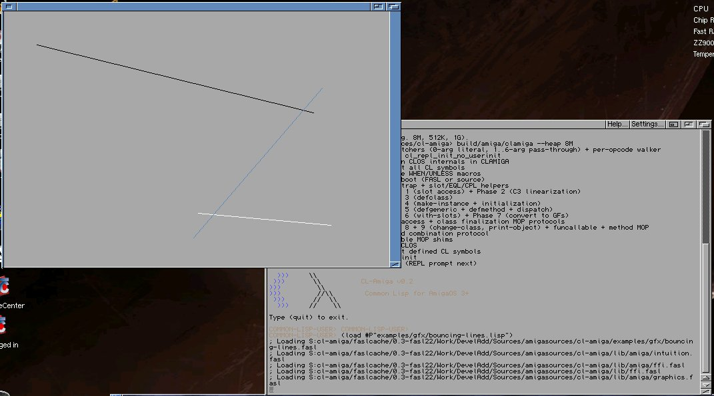
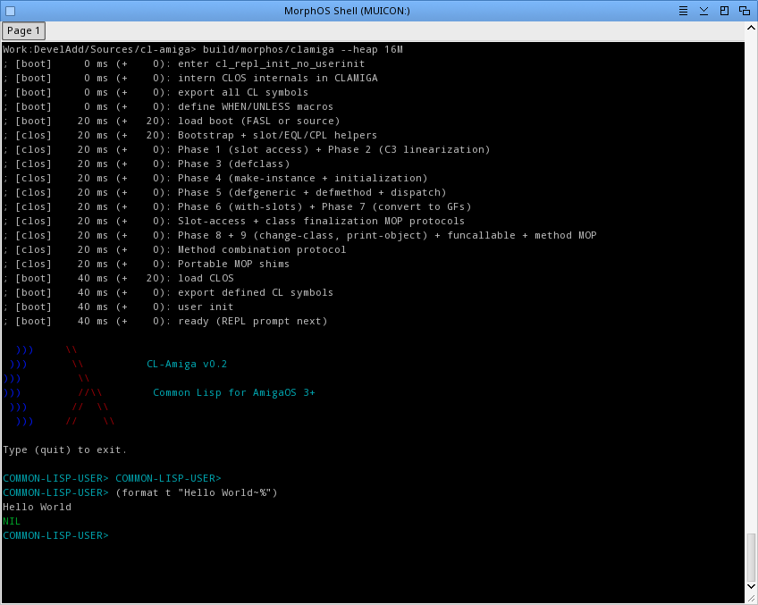
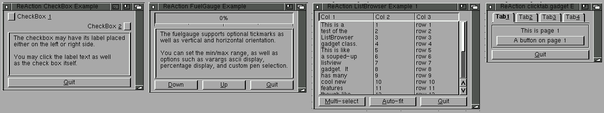

# CL-Amiga (Clamiga)

[](https://github.com/mdbergmann/cl-amiga/actions/workflows/ci.yml)

A Common Lisp implementation for AmigaOS 3+ (68020+) and, as a fully native PPC build, MorphOS — with AmigaOS 4 in reach on the same path — but also macOS and Linux.

> **Alpha software** — CL-Amiga is under active development. The core language is functional and can run real-world CL libraries, but ANSI CL compliance is incomplete and APIs may change. See [Known Limitations](#known-limitations-and-future-work) for details.

CL-Amiga is a bytecode-compiled Common Lisp environment written in C (C89/C99). It aims for ANSI Common Lisp compatibility and runs on classic Amiga hardware (or emulators like FS-UAE) as well as modern POSIX hosts (macOS, Linux).

## Why CL-Amiga?

There are already excellent Common Lisp implementations — SBCL, CCL, ECL, Clasp, CLISP — so why another one?

**Because none of them run on the Amiga** — neither the classic 68k machines nor the PPC-based next-gen systems (MorphOS, AmigaOS 4). The high-performance implementations (SBCL, CCL) are native-code compilers tied to modern architectures — x86-64, ARM, PPC — with no 68k backend and a memory footprint measured in tens of megabytes. Clasp is built on LLVM and targets C++ interop. CLISP, the closest in spirit — a compact bytecode interpreter in C — hasn't had a maintained AmigaOS build in decades.

CL-Amiga is built for the constraint the others ignore: **a 68020 at 14 MHz with 4 MB of RAM (or even less).** It's a self-contained bytecode VM in portable C89/C99 with no external runtime dependencies — no libffi (there's a hand-written 68k trampoline), no LLVM, no C compiler needed at runtime. Values are 32-bit tagged words and heap pointers are arena-relative offsets, keeping the whole object model 32-bit-clean; a compacting GC keeps a small heap from fragmenting, and on real 68k hardware there's an optional native JIT. Yet it's ambitious enough on the language side to load ASDF, run Quicklisp, and pass the self-tests of real libraries (Alexandria, FSet, fiveam, Sento) — and it runs identically on a modern macOS/Linux host, where most development actually happens.

Because execution is bytecode, the object model is **architecture-agnostic**: the same compiled Lisp runs unchanged on 68k and PowerPC. Two targets are fully working today: classic **AmigaOS 3+** on 68020+ and a **fully native MorphOS (PPC)** build — including threading, FFI, GUI, and audio; even the compiled FASL files are compatible between the two (the MorphOS build has full Unicode strings, and its writer downgrades all-ASCII strings to the byte format the 68k build reads — only FASLs with non-ASCII string literals are PPC-side only). **AmigaOS 4** — the other PPC-based next-gen system — is a natural target on the same path. So while the design's tightest constraint is the classic Amiga, the aim is the whole Amiga family, not just the 68k machines.

In short: it exists to bring a modern, ANSI-aiming, library-capable Common Lisp to hardware every other implementation left behind — without giving up comfortable development on a fast host.

### The name

**CL-Amiga** is simply *Common Lisp for the Amiga*. Say it out loud and it becomes **Clamiga** — and *amiga* is Spanish/Portuguese for a (female) friend. So the name does double duty: the Lisp that runs on your Amiga, and the Lisp that's your *amiga*. 🙂

### How it compares

| Implementation | Approach | Amiga family (68k / PPC)? | Footprint | Notes |
|---|---|---|---|---|
| **CL-Amiga** | Bytecode VM in C, optional m68k JIT | **Yes** — its whole reason to exist (68k + native MorphOS/PPC now; OS4 next) | Tiny (core runs in a 1 MB heap) | Alpha; ANSI coverage incomplete |
| **ECL** | Lisp → C, bytecode fallback | No | Medium | Very portable/embeddable on modern hosts |
| **CCL** | Native compiler | No (x86-64/ARM/PPC only) | Large | Fast and mature; no 68k backend |
| **Clasp** | LLVM-based, C++ interop | No | Very large (needs LLVM) | Best for C++/scientific interop |
| **SBCL** | Native compiler | No | Large | Fastest mainstream CL; modern arch only |
| **CLISP** | Bytecode interpreter in C | Historically, now unmaintained | Small | Closest in spirit; no current Amiga build |

**Pros:** runs where nothing else does; tiny and dependency-free; identical behavior on host and Amiga; small, readable C you can actually hack on.
**Cons:** alpha-quality ANSI coverage; a bytecode VM with a light JIT won't match a native compiler's raw speed; the object model is 32-bit throughout, so even on a 64-bit host the heap is capped at 4 GB (a deliberate trade for a compact, Amiga-faithful representation); the ecosystem is (so far) an ecosystem of one.

## Useful information on Common Lisp

[My post about Clamiga](https://nnamgreb.de/blog/Clamiga+-+Common+Lisp+for+the+Amiga)

[Common Lisp Cookbook](https://lispcookbook.github.io/cl-cookbook)

[Peter Seibel's Practical Common Lisp book](https://gigamonkeys.com/book/)

## Status

CL-Amiga can load **ASDF**, install and run **Quicklisp**, and successfully quickload libraries including **Alexandria**, **fiveam**, **FSet**, and **Sento** — their `asdf:test-system` suites pass end-to-end. Sento pulls in **lparallel**, **serapeum**, **bordeaux-threads**, **log4cl** and friends along the way.

**ANSI conformance** — the Paul Dietz ANSI test suite (`third_party/ansi-test/`) is the working spec. A bootstrap in `trunk/` runs it on host and Amiga:

- **CONS, SYMBOLS, NUMBERS, and SEQUENCES** (`load-and-test-ansi.lisp`) — passing.

A broad test suite covers the implementation, including threading, CLOS, conditions, the full numeric tower, FFI, the m68k JIT, and AmigaOS GUI (Intuition/Graphics/GadTools).

### Screenshots

| AmigaOS 3 | MorphOS |
|---|---|
|  |  |

ReAction GUIs from Lisp — four of the [`examples/amiga/reaction/`](examples/amiga/reaction/) ports of the NDK examples, running on AmigaOS 3.2:



## Building

### Host (macOS / Linux)

```
make host          # Build for host (gcc)
make test          # Fast test tier (C unit + shell tests)
make test-plus     # Fast tier + host-cold-test (sento cold-load smoke test)
make test-extra    # Heavyweight trunk integration scripts
make clean         # Remove build artifacts
```

### Host (Windows)

`make host` also builds a **native Windows executable** — a real `.exe` with no
msys2 runtime DLL behind it — from an [MSYS2](https://www.msys2.org/) mingw
shell (CLANGARM64, UCRT64 or MINGW64):

```
pacman -S mingw-w64-clang-aarch64-{clang,libffi,make}   # CLANGARM64; adjust prefix
make host CC_HOST=clang       # -> build/host/clamiga.exe
make test CC_HOST=clang
```

The Makefile detects the mingw environment from `uname -s` and switches the
platform layer to `src/platform/platform_win32.c` (Winsock, the console API,
`VirtualAlloc`, `LoadLibrary`), so the same targets work as on macOS/Linux.
Everything the runtime offers on a POSIX host is available: threads (MP),
sockets and TLS, the FFI, the generational GC, the debugger and the REPL.

Two Windows-specific notes:

- **Paths.** Namestrings use `/`; a drive letter appears as the pathname's
  device, so `(truename "Makefile")` prints as `#P"C:/Users/you/cl-amiga/Makefile"`.
- **OpenSSL** is loaded at runtime, as on every other host. It is found by DLL
  name (`libssl-3-arm64.dll`, `libssl-3-x64.dll`, …) on `PATH`; point
  `CLAMIGA_LIBSSL` / `CLAMIGA_LIBCRYPTO` at specific files to override.
  `(ext:tls-available-p)` reports what was found.

### Pre-commit hook (auto-review + tests)

Optional. A `pre-commit` hook reviews staged changes with a headless `claude`
(auto-fixing issues and re-staging), then runs the fast test tier
(`make test-fast` — no sento) and blocks the commit on failure. Activate once
per clone:

```
make install-hooks
```

Bypass a single commit with `git commit --no-verify`. See
[`scripts/review/README.md`](scripts/review/README.md) for the full flow,
toggles, and safety guarantees.

(For building the AmigaOS or MorphOS binary, see [Building for AmigaOS and MorphOS](#building-for-amigaos-and-morphos) below.)

## Usage

```
./clamiga                      # Start REPL
./clamiga --load hello.lisp    # Same as above
./clamiga --heap 8M            # Start with 8 MB heap
./clamiga --boot-log           # Print boot phase timings ("; [boot] ...")
```

`--help` lists all options. `--boot-log` is handy on slow Amiga hardware
(shows progress during the multi-second boot) and for spotting startup-time
regressions; see `tests/test_boot_log.sh` for the exact behavior.

### REPL results

The REPL prints **every** value a form returns, one per line, starting on a
fresh line even when the form's own output didn't end with a newline — a form
that returns no values prints nothing at all. Input may span lines: an open
paren or an unfinished string literal makes the REPL prompt for the rest of
the form instead of erroring.

```lisp
CL-USER> (floor 7 2)
3
1
CL-USER> (values)
CL-USER> (let ((x (floor 7 2))) x)   ; one value, so one line
3
```

The standard history variables (CLHS 25.1.1) are bound after each form:
`*`, `**`, `***` hold the last three *primary* values, `/`, `//`, `///` the
last three value *lists*, and `+`, `++`, `+++` the last three forms
(`-` is the form currently being evaluated).

```lisp
CL-USER> (floor 7 2)
3
1
CL-USER> (list * /)
(3 (3 1))
```

See `tests/test_repl_values.sh` (interactive loop) and `tests/test_batch.sh`
(`--batch` loop) for the exact behavior.

### Version

From Lisp, on any platform:

```lisp
(lisp-implementation-type)     ; => "CL-Amiga"
(lisp-implementation-version)  ; => "0.7.0"
```

On AmigaOS the binary also carries a standard `$VER:` cookie, so the Shell's
`Version` command works without starting the REPL:

```
1> Version clamiga
clamiga 0.7 (16.08.2026)
```

See `tests/test_version.c` for the full contract.

### Heap and stack sizing

The default heap is **4 MB**. On the Amiga, plain clamiga — without Quicklisp and ASDF — gets by with as little as **`--heap 1M`** for writing simple programs: the full Common Lisp core boots in about **0.5 MB** (`(room)` on a fresh 1 MB-heap session reports ~51% used). Larger workloads need more:

| Use case                                  | Heap             | Amiga stack       |
|-------------------------------------------|------------------|-------------------|
| Simple programs (Amiga, no Quicklisp/ASDF)| `--heap 1M`      | 64K (default)     |
| REPL / small programs                     | 4M (default)     | 64K (default)     |
| Loading ASDF                              | `--heap 11M`     | 64K (default)     |
| Quicklisp + quickload libraries           | `--heap 24M`     | `stack 128000`    |
| FSet (functional collections)             | `--heap 24M`     | `stack 128000`    |
| Fiveam (load + self-tests)                | `--heap 24M`     | `stack 128000`    |

On AmigaOS, the default 64K stack is sufficient for basic use. For Quicklisp/ASDF workloads with deep CLOS dispatch chains, or when source-compiling GUI code (deeply nested macro towers), increase the stack:

```
stack 128000
clamiga --heap 24M
```

If the stack is too small for a deeply nested form, clamiga signals a clean
`C stack nearly exhausted` error telling you to raise it — it never corrupts
the session.

### Quicklisp

Quicklisp runs on CL-Amiga, but the stock client doesn't recognise this implementation and pulls in libraries that assume features we don't have yet. So the project ships a small compat layer, a set of **library backends** — maintained forks of a few systems that now carry first-class CL-Amiga support behind `#+cl-amiga` / `#+clamiga` branches — and a tiny `swank` stub, and keeps the bootstrap entirely on its own side. The library forks are deliberately minimal and exist to be upstreamed once the remaining API gaps close.

**Installing Quicklisp on a fresh system** (where `~/quicklisp/` — Amiga: `S:quicklisp/` — does not exist yet). Do this once:

```lisp
(require "asdf")
(load "lib/quicklisp-install.lisp")
(cl-amiga-ql:install)                 ; downloads + installs the QL client, patches networking
```

`cl-amiga-ql:install` runs the standard `quicklisp-quickstart:install`, catches the network error it raises (CL-Amiga isn't a registered `ql-impl` yet), loads the compat shim so networking works, and retries the dist install. The bundled shim systems in `lib/shims/` — the `swank` stub and the `cl+ssl` facade (which routes drakma/Hunchentoot TLS through CL-Amiga's native `ext:socket-start-tls` instead of the CFFI-based original) — need no installation: loading ASDF registers them on `asdf:*central-registry*`, which is searched ahead of the Quicklisp and ocicl searchers, so they shadow the stock dist copies automatically. To opt out of the auto-registration, set `CLAMIGA_NO_SHIMS` to `1` in the environment before starting clamiga — host: `CLAMIGA_NO_SHIMS=1 clamiga`, Amiga shell: `SetEnv CLAMIGA_NO_SHIMS 1` (any other value, or unsetting it, re-enables the shims). One thing still needs to be on disk in `~/quicklisp/local-projects` (Amiga: `S:quicklisp/local-projects`): the CL-Amiga **library forks** (listed below), which you install by cloning them into that directory — Quicklisp's local-projects searcher then resolves them ahead of the stock dist releases.

**Using Quicklisp** in any later session, once it is installed:

```lisp
(load #P"~/quicklisp/setup.lisp")
(load "lib/quicklisp-compat.lisp")
(ql:quickload "alexandria")
```

**What we patch** (the local changes shipped with the project):

- `lib/quicklisp-compat.lisp` — routes Quicklisp's networking through `ext:open-tcp-stream` and plain CL stream ops (working around generic-function dispatch limits in the stock `ql-network` interface), and adapts `directory-entries` to CL-Amiga's `directory`. All Quicklisp downloads (installer and dist fetches alike) run with socket timeouts armed — a dead or stalled connection signals `ext:socket-timeout` instead of hanging the image; see `tests/test_ql_socket_timeouts.sh`.
- **CL-Amiga library forks** (cloned into `~/quicklisp/local-projects`) — maintained forks that carry first-class CL-Amiga support behind `#+cl-amiga` / `#+clamiga` branches, so a stock `quickload` resolves them like any other implementation backend rather than needing a replacement package. See the [Library forks (CL-Amiga backends)](#library-forks-cl-amiga-backends) table below for the full list.
- `lib/shims/swank` — a tiny stub package: several libraries such as clack name the `swank` system only to reach a couple of symbols for an optional remote-debug server they never start. It stays a shim (there is no upstream to fork) and is auto-registered on `asdf:*central-registry*` when ASDF loads.
- `lib/asdf.lisp` — `#+cl-amiga` adaptations: real binary FASL compile/load for cross-session persistence, AmigaOS path/device handling, and `*asdf-session*` NULL-safety.

Libraries confirmed working via `quickload` + `asdf:test-system` (`trunk/run-load-and-test-all.sh`) include **fiveam**, **FSet**, **cl-spark**, **str**, **closer-mop**, **CFFI**, **chipi** (cl-hab), and **Sento** — plus, on the host, the **drakma** HTTP/HTTPS client and the **Hunchentoot** web server (these two need a TCP/IP stack; see [Integration test scripts](#integration-test-scripts)). Loading these pulls in and exercises a much wider dependency graph along the way — **alexandria, serapeum, lparallel, log4cl, bordeaux-threads, cl+ssl, usocket, chipz, cl-who** and friends. Sento cold-compiles its full dependency tree, so give it ~96–128M of heap (more for a cold cache) and `stack 800000` on Amiga.

### Ocicl

[Ocicl](https://github.com/ocicl/ocicl) is an alternative to Quicklisp that distributes ASDF systems as OCI artifacts pulled from a container registry. It has two halves: the `ocicl` command-line tool, which fetches systems over HTTPS into a project-local `systems/` directory, and a runtime hook that teaches ASDF where to find them. CL-Amiga consumes the second half directly — once the systems are on disk, an `ocicl`-managed `systems/` tree is just `.asd` files plus sources, which CL-Amiga's ASDF loads like any other source registry.

**Install the systems with the host `ocicl` tool.** Run the upstream CLI (on the macOS/Linux host, or anywhere you have it) from your project directory to vendor the systems you need:

```sh
cd my-project
ocicl install alexandria       # downloads into ./systems/ and records ./systems.csv
```

This populates a `systems/` subdirectory and a `systems.csv` manifest inside the project.

**Point ASDF at the tree from `.clamigarc`.** CL-Amiga reads `~/.clamigarc` (Amiga: `S:.clamigarc`) at startup, so add an `asdf:initialize-source-registry` form there to register the project's `systems/` directory as a search tree. ASDF requires `:tree`/`:directory` pathnames to be **absolute**, so merge the relative subdirectory against `*default-pathname-defaults*` (seeded with the current working directory) rather than passing a bare relative `#P"systems/"`:

```lisp
(require "asdf")
(asdf:initialize-source-registry
  `(:source-registry
    (:tree ,(merge-pathnames "systems/" *default-pathname-defaults*))
    :inherit-configuration))
```

(Note the backquote and `,` — the form is built with a computed absolute pathname, not quoted literally.) If the project doesn't live at the directory clamiga is launched from, use the `:home` token (resolved against your home directory regardless of the cwd) or a plain absolute pathname instead:

```lisp
(asdf:initialize-source-registry
  '(:source-registry
    (:tree (:home "my-project/systems/"))
    :inherit-configuration))
```

`ocicl` sometimes vendors into `ocicl/` rather than `systems/`; list both as separate `:tree` entries (earlier entries win on name clashes) so either layout is picked up:

```lisp
(asdf:initialize-source-registry
  `(:source-registry
    (:tree ,(merge-pathnames "systems/" *default-pathname-defaults*))
    (:tree ,(merge-pathnames "ocicl/"   *default-pathname-defaults*))
    :inherit-configuration))
```

After that, `(asdf:load-system "alexandria")` resolves against the `ocicl`-installed copy. Because this is plain ASDF, the CL-Amiga library forks listed below still apply — clone any needed `*-clamiga.lisp` fork into a directory covered by the source registry so it takes precedence over the stock system. The bundled shims need no such step: `asdf:*central-registry*` (where `lib/shims/` registers) is searched before the source registry, so an `ocicl`-vendored `cl+ssl` or `swank` is shadowed by the CL-Amiga facade/stub automatically.

> CL-Amiga does not yet run the `ocicl` fetcher natively (that needs an on-Amiga OCI-registry client); install on the host and copy or share the `systems/` tree to the Amiga side.

### Library forks (CL-Amiga backends)

Several third-party libraries don't recognise CL-Amiga and either lack a porting
layer for it or assume features of other implementations. For these, the project
maintains forks that add a CL-Amiga backend (a new `*-clamiga.lisp` file) or a
small `#+cl-amiga` / `#+clamiga` adaptation. Clone them into
`~/quicklisp/local-projects/` (Amiga: `S:quicklisp/local-projects/`) so
Quicklisp's local-projects searcher picks them up ahead of the stock dist
versions. The goal is to upstream each one as the remaining API gaps close.

| Library | Fork repository | What the CL-Amiga support adds |
|---------|-----------------|--------------------------------|
| **usocket** | https://github.com/mdbergmann/usocket | `backend/clamiga.lisp` — a usocket backend that wraps CL-Amiga's `EXT`-package TCP sockets/streams. The networking foundation for drakma and Hunchentoot. |
| **bordeaux-threads** | https://github.com/mdbergmann/bordeaux-threads | `apiv1/impl-clamiga.lisp` + `apiv2/impl-clamiga.lisp` — maps the BT v1 and v2 thread/lock/condition-variable surface onto CL-Amiga's `MP` package. Pulled in by Sento, lparallel, and most concurrent libraries. |
| **cffi** | https://github.com/mdbergmann/cffi | `src/cffi-clamiga.lisp` — a CFFI-SYS backend built on CL-Amiga's `FFI` package (fully functional on the POSIX host; AmigaOS uses the library-vector model). Lets CFFI-dependent systems load. |
| **trivial-features** | https://github.com/mdbergmann/trivial-features | `src/tf-clamiga.lisp` — populates `*features*` with CL-Amiga's OS/CPU/endianness keywords. Required by CFFI and cl+ssl for platform detection. |
| **closer-mop** | https://codeberg.org/mdbergmann/closer-mop | `#+clamiga` package definition plus a `closer-clamiga.lisp` backend that re-export CL-Amiga's native AMOP subset under the CLOSER-MOP / C2MOP / C2CL names. |
| **trivial-cltl2** | https://github.com/mdbergmann/trivial-cltl2 | `clamiga.lisp` backend supplying the CLtL2 functions serapeum/trivia call (`declaration-information`, `variable-information`, `function-information`, `compiler-let`, `parse-macro` / `enclose`). |
| **introspect-environment** | https://github.com/mdbergmann/introspect-environment | `#+cl-amiga` `typexpand` / `typexpand-1` built on CL-Amiga's deftype expander table (`clamiga::%type-expander`), so callers like serapeum's `explode-type` can resolve user `deftype` aliases. |
| **trivial-garbage** | https://github.com/mdbergmann/trivial-garbage | `#+cl-amiga` finalizers and weak pointers, with weak hash-tables falling back to ordinary (strong) tables. |
| **trivial-gray-streams** | https://github.com/mdbergmann/trivial-gray-streams | `#+clamiga` branch importing CL-Amiga's native `GRAY` package (same package name as ECL/CLISP) and bridging the `stream-read-sequence` / `stream-write-sequence` generics. The portability layer most Gray-stream users (flexi-streams, chipz, drakma, Hunchentoot) build on. |
| **chipz** | https://github.com/mdbergmann/chipz | `#+cl-amiga` Gray-stream branch in `stream.lisp` — makes `make-decompressing-stream` work. Enables drakma's gzip/deflate `:decode-content`. |
| **float-features** | https://codeberg.org/mdbergmann/float-features | `#+cl-amiga` branch using CL-Amiga's IEEE float-bits builtins (`clamiga:single-float-bits`, …). Needed by jzon to serialize floats (e.g. chipi-api's SSE JSON). |
| **rfc2388** | https://github.com/mdbergmann/rfc2388 | `#+cl-amiga` MIME multipart parsing using a `:latin-1` external format. Used by Hunchentoot for multipart form/file uploads. |
| **cl-fad** | https://github.com/mdbergmann/cl-fad | `#+:cl-amiga` directory/pathname/file utilities (`list-directory`, `file-exists-p`, …) mapped onto CL-Amiga's `directory`/`probe-file`. Used by Hunchentoot. |
| **hunchentoot** | https://github.com/mdbergmann/hunchentoot | `#+:cl-amiga` web-server adaptations (e.g. `set-timeouts` over the usocket clamiga backend). Runs CL-Amiga as an HTTP server. |
| **atomics** | https://codeberg.org/mdbergmann/atomics | `#+clamiga` branch in `atomics.lisp` mapping `cas` / `atomic-incf` / `atomic-decf` onto `mp:compare-and-swap` / `mp:atomic-incf` / `mp:atomic-decf`. Backs bordeaux-threads v2's atomic API. |
| **fset** | https://github.com/mdbergmann/fset | `#+cl-amiga` branches in `Code/port.lisp` (lock/memory-barrier stubs onto the `MP` package, a `make-char` helper). The functional-collections library; its own suite passes 17/17 on CL-Amiga. |

> **fset dependency:** fset 2.4.x requires `misc-extensions` ≥ 4.2.4, which is
> newer than the version in the bundled Quicklisp dist. Clone the upstream
> [slburson/misc-extensions](https://github.com/slburson/misc-extensions) (≥ 4.2.4)
> into `~/quicklisp/local-projects/` as well — it needs no CL-Amiga patch and
> loads as-is, but the local-projects copy must take precedence over the older dist
> release for fset to build.

### Integration test scripts

Reusable Lisp loaders in `trunk/` that load and exercise third-party libraries on both host and Amiga:

```
./build/host/clamiga --heap 24M  --load trunk/load-and-test-alexandria.lisp     # Alexandria (250/250)
./build/host/clamiga --heap 24M  --load trunk/load-and-test-5am.lisp            # Fiveam
./build/host/clamiga --heap 24M  --load trunk/load-and-test-fset.lisp           # FSet
./build/host/clamiga --heap 64M  --load trunk/load-and-test-trivia.lisp         # Trivia pattern matcher (490/490)
./build/host/clamiga --heap 24M  --load trunk/load-and-test-cl-spark.lisp       # cl-spark (sparklines, 68/68)
./build/host/clamiga --heap 64M  --load trunk/load-and-test-str.lisp            # str
./build/host/clamiga --heap 192M --load trunk/load-and-test-sento-system.lisp   # Sento (cold cache)
./build/host/clamiga --heap 192M --load trunk/load-and-test-knx-conn.lisp       # knx-conn KNXnet/IP (fiveam)
./build/host/clamiga --heap 96M  --load trunk/load-and-test-ansi.lisp           # ANSI cons + symbols + numbers
./build/host/clamiga --heap 256M --load trunk/load-and-test-cffi.lisp           # CFFI backend
./build/host/clamiga --heap 256M --load trunk/load-and-test-drakma.lisp         # drakma HTTP/HTTPS (host only)
./build/host/clamiga --heap 256M --load trunk/load-and-test-hunchentoot.lisp    # Hunchentoot server (host only)
./build/host/clamiga --heap 256M --load trunk/load-and-test-hunchentoot-ssl.lisp # Hunchentoot HTTPS server (host only)
./build/host/clamiga --heap 256M --load trunk/load-and-test-chipi-api.lisp      # chipi web API tests (host only)
./build/host/clamiga --heap 256M --load trunk/load-and-test-chipi-ui.lisp       # chipi-ui CLOG UI tests (host only)
```

`load-and-test-drakma.lisp` drives **drakma** as an HTTP/HTTPS **client** and
runs drakma's own test suite: plain HTTP and HTTPS, GET and POST, streamed and
gzip-decoded responses, and certificate verification. It loads over the
**usocket** cl-amiga backend, with HTTPS through the bundled **cl+ssl facade**
over the native TLS layer (see [TLS](docs/ext.md#tls)) and the **chipz** fork
for decompression.

`load-and-test-hunchentoot.lisp` runs cl-amiga itself as a web **server**: it
starts a Hunchentoot `easy-acceptor` and runs Hunchentoot's built-in confidence
suite against it (driving drakma over loopback through cookies, sessions,
multipart parameters, redirection and basic auth), rendering HTML with
**cl-who**.

`load-and-test-hunchentoot-ssl.lisp` is the HTTPS variant: a Hunchentoot
`easy-ssl-acceptor` serves the same confidence suite over TLS on loopback,
with drakma as the HTTPS client — CL-Amiga is both ends of every encrypted
connection.

These scripts are **host-only** — they need a TCP/IP stack and network access;
the same TLS stack on Amiga is covered by `tests/amiga/tls-tests.lisp` in the
FS-UAE suite (with AmiSSL installed in the emulated Workbench).

### Loading source and FASL files

CL-Amiga ships a bytecode VM, so `compile-file` writes a `.fasl` and `load` can take either a `.lisp` source or a precompiled `.fasl`.

| Call                       | Behaviour                                                                                                                                                                                  |
|----------------------------|--------------------------------------------------------------------------------------------------------------------------------------------------------------------------------------------|
| `(load "x.lisp")`          | Looks up a cached FASL in the per-user cache (see below) and loads it if its mtime ≥ the source. Otherwise loads the source and **auto-writes** a fresh FASL to the cache for next time.   |
| `(load "x.fasl")`          | Loads that exact file. The per-user cache is **not** consulted — `.fasl` inputs are already-compiled artifacts.                                                                            |
| `(require "name")`         | Searches `lib/name.fasl` and `lib/name.lisp` (and `PROGDIR:lib/...` on Amiga) and picks the FASL when its mtime ≥ source. The name is a string designator — `(require :asdf)` and `(require 'asdf)` work too: the search retries the lowercase spelling, and a module already in `*modules*` under any case is not loaded again. Used internally for `clos`, `asdf`, etc. |
| `(compile-file "x.lisp")`  | Writes to the cache path (= what `compile-file-pathname` returns). `:output-file "x.fasl"` overrides.                                                                                      |

When a literal object reachable from compiled code is an instance of a class that defines a `make-load-form` method (CLHS 7.6), `compile-file` serializes the object as that method's creation + initialization forms and reconstructs it via those forms at load time, instead of dumping it slot-for-slot. `make-load-form-saving-slots` is provided, and the reconstructed object preserves a slot that points back at itself (the circular self-reference). Plain structures with no method keep the built-in fast path. See `tests/test_make_load_form.sh` (host) and the MAKE-LOAD-FORM cases in `tests/amiga/run-tests.lisp` (Amiga) for runnable examples.

**Per-user cache locations** (keyed by `clamiga` version + FASL format version, so a version bump invalidates everything automatically):

- POSIX: `~/.cache/common-lisp/cl-amiga-<version>-fasl<n>/<source-path>.fasl`
- AmigaOS: `S:cl-amiga/faslcache/<version>-fasl<n>/<source-path>.fasl`

Pre-built `lib/boot.fasl` and `lib/clos.fasl` ship with the binary; on the lower-end 020 baseline this cuts cold boot from ~92 s to ~9 s. `make fasl` regenerates them after editing `lib/boot.lisp`/`lib/clos.lisp`.

`make fasl-amiga` does the same for everything under `lib/amiga/` (the curated modules, `AMIGA.REACTION` and the generated raw OS bindings), writing `lib/amiga/**/*.fasl` next to the sources: an Amiga run of the tree — the FS-UAE suite, or a real machine with the repo on it — then loads e.g. `lib/amiga/raw/intuition.fasl` instead of compiling ~4k forms on a 68020 at the first `(require "amiga/raw/intuition")`. This is optional for development (the Amiga's faslcache does the same lazily on first use), the files are gitignored, and `REQUIRE` ignores a FASL that is older than its source or was written by another FASL format version. The binary release ships these FASLs (see below). The host-compiled FASLs are portable because the FASL format is arch/endian-neutral and the `lib/amiga` sources have no reader conditionals — all platform variance is decided at load time. See `tests/test_lib_fasl_portable.sh`.

Note: string literals in the `lib/` modules that ship as FASLs must stay ASCII-only — the m68k Amiga build is compiled without `CL_WIDE_STRINGS` to save RAM and cannot read FASLs that contain `FASL_TAG_WIDE_STRING`. The host and MorphOS builds have `CL_WIDE_STRINGS` (full Unicode, `CHAR-CODE-LIMIT` 1114112 — required by e.g. flexi-streams/drakma); their writers auto-downgrade all-ASCII wide strings to byte strings, so the shared `lib/` FASLs stay readable everywhere. `make fasl`, `make fasl-amiga` and the release script compile with `CLAMIGA_FASL_PORTABLE=1`, which makes the writer refuse such a literal on the host — the diagnostic names the file, source line and code point (`U+2014` for the usual em dash) — instead of the Amiga failing the whole module with a `BAD_TAG` deserialize error at load time. Comments and docstrings are unaffected (neither reaches the FASL).

### Exit hooks

`ext:*exit-hooks*` holds functions clamiga calls on its way out — after
`(quit)`, at the end of a `--script` / `--non-interactive` run, and when the
REPL reaches end of input. They run before any runtime teardown, so a hook can
still print, write files and stop threads. `(quit)` unwinds without running
`unwind-protect` cleanups, so this is the only place user code sees process
exit.

```lisp
(ext:add-exit-hook (lambda () (save-state "work.dat")))
(ext:add-exit-hook 'shutdown-server)      ; symbol resolved when the hook runs
(ext:remove-exit-hook 'shutdown-server)   ; => T if it was registered
```

Hooks run most recently added first; one that signals an error is reported and
skipped, and the rest still run. See [docs/ext.md](docs/ext.md#exit-hooks) and
the runnable examples in `tests/test_exit_hooks.c` / `tests/test_exit_hooks.sh`.

### Heap images

`(ext:save-image "mysession.img")` snapshots the entire session — everything
loaded, defined and computed — to one file, and `clamiga --image mysession.img`
is back at that exact state in a single read, skipping boot and all loads.  On
a 14MHz Amiga that turns a minutes-long quicklisp warm-up into a near-instant
start; a game or app can ship as `clamiga` + `app.img`.

```lisp
(load "my-big-system.lisp")
(ext:save-image "mysession.img" :quit t)   ; write the image and exit
```

```
clamiga --image mysession.img              ; next day: instantly back
```

A file named `clamiga.img` in the current directory (or next to the binary, or
in an install prefix's `lib/clamiga/`) is restored automatically at startup;
`--no-image` skips that.  Images are strictly per-build — a fingerprint makes
any other clamiga build (or platform/variant) refuse them cleanly — and can be
restored into a larger `--heap` than they were saved with.  Worker threads and open file/socket streams must be closed before
saving; `ext:*save-hooks*` / `ext:*restore-hooks*` exist to tear down and
rebuild such OS state around the snapshot, and `ext:*image-restored-p*` lets
`~/.clamigarc` skip loads the image already contains.

For a shipped application image, `:shake-bindings t` additionally drops the
demand-interned binding tables of the raw OS modules (~150 KB for the four
common ones).  Names the program referenced before the save keep working;
names it never referenced stop existing — the delivery trade, described in
[docs/ext.md](docs/ext.md#shipping-an-image-shake-bindings).

See [docs/ext.md](docs/ext.md#heap-images) and the runnable examples in
`tests/test_image.sh` / `tests/test_image.c` (host) and
`tests/amiga/image-save.lisp` / `image-verify.lisp` (Amiga).

## Host FFI (dlopen + libffi + CFFI)

The `FFI` package provides foreign pointers and typed peek/poke on **all**
platforms (on AmigaOS the `AMIGA` package adds register-based library calls — see
[Raw FFI Access](#raw-ffi-access)). On the POSIX dev host the `FFI` package
additionally provides a real, general-purpose foreign-function engine — dynamic
library loading (`ffi:load-library`/`ffi:symbol-pointer` via `dlopen`/`dlsym`),
arbitrary C calls with full argument/return marshaling (`ffi:call-foreign`,
libffi-backed, incl. variadics), Lisp-as-C callbacks (`ffi:make-callback`, libffi
closures), and typed memory access
(`ffi:peek-i8/i16/i32/u64/i64/single/double/pointer` and the matching `poke-*`).

```lisp
;; Resolve and call libc directly
(ffi:call-foreign (ffi:symbol-pointer "pow") :double '(:double :double) '(2d0 10d0))
;; => 1024.0d0
```

On top of this engine cl-amiga ships a **CFFI** backend (`cffi-clamiga.lisp`,
in the CFFI source tree), so the standard CFFI API — `defcfun`,
`foreign-funcall`, `mem-ref`, `defcallback`, `defcstruct`, foreign strings —
works on the host. This is what lets CFFI-dependent Quicklisp systems load.
Foreign calls/callbacks are host-only; on AmigaOS use the library-vector model
(`AMIGA.FFI`) instead. See `tests/test_ffi.c` and
`trunk/load-and-test-cffi.lisp` for runnable end-to-end examples.

## Emacs (SLY) integration

CL-Amiga speaks the SLYNK protocol, so you can drive it from Emacs with [SLY](https://github.com/joaotavora/sly) — REPL, completion, `M-.`, the inspector, and the SLDB debugger. This targets the **host** build (`build/host/clamiga`) and needs a SLY checkout whose `slynk/backend/` includes the CL-Amiga backend (`clamiga.lisp`) — [this SLY fork](https://github.com/mdbergmann/sly) ships it.

clamiga comes up exactly like every other implementation — there is no clamiga-specific Lisp startup file or init form. The backend (`slynk/backend/clamiga.lisp`) pulls in clamiga's Gray streams itself via `(require "gray-streams")`, which needs to locate the bundled `lib/`.

clamiga finds `lib/` in three ways, in order: relative to the current working directory (so running it from the source root just works), under **`$CLAMIGA_HOME`**, and relative to the clamiga executable itself. The executable-relative lookup tries three layouts — `lib/` next to the binary (binary release), `../lib/clamiga/` (an install prefix: `<prefix>/bin/clamiga` + `<prefix>/lib/clamiga/`, the same layout SBCL uses), and `../../lib/` above it (the in-repo `build/host/clamiga`) — so an installed clamiga, or a symlink to the in-repo binary on `$PATH`, locates the bundled `lib/` from any directory with no environment setup at all. The same three locations are searched for a `clamiga.img` [heap image](#heap-images). On AmigaOS the executable-relative lookup is `PROGDIR:`. `CLAMIGA_HOME` is only needed for a binary that sits in none of those layouts (e.g. a bare copy of the executable); see `tests/test_lib_search_cwd.sh` for the exact resolution behavior.

> **Heap sizing:** the 4 MB default thrashes the GC once SLYNK and its contribs load. Use **`--heap 96M` as a practical minimum** — that also carries a real application's dependency graph (e.g. `(asdf:load-system :sento)`). Give more headroom (`512M`) if you can.

### Method A — auto-start with `M-x sly` (recommended)

Add a `clamiga` entry to `sly-lisp-implementations`. Don't set SLY's `:directory` — the executable-relative `lib/` lookup (or `CLAMIGA_HOME`) already lets clamiga start from anywhere, so the connection's working directory stays free to follow the buffer you start from:

```elisp
(defvar my/clamiga-root "/path/to/cl-amiga")
(defvar my/clamiga-bin  (expand-file-name "build/host/clamiga" my/clamiga-root))

;; Optional: only needed when the binary lives outside the cl-amiga tree —
;; build/host/clamiga finds its lib/ by itself via the executable location.
(setenv "CLAMIGA_HOME" my/clamiga-root)

(with-eval-after-load 'sly
  (add-to-list 'sly-lisp-implementations
               `(clamiga (,my/clamiga-bin "--heap" "512M"))))
```

(If you prefer the old behaviour of pinning the working directory to the source root, drop the `setenv` and add `:directory ,my/clamiga-root` back to the entry instead.)

Then `M-x sly` and pick `clamiga` (or `C-u M-x sly` to choose). SLY starts a server on an OS-assigned port (via ASDF + `slynk.asd`, which includes the CL-Amiga backend) and connects automatically.

### Method B — external server + `M-x sly-connect`

Start a server in a terminal, then connect to it (useful to keep the image alive across reconnects). A launcher ships with cl-amiga:

```sh
# From the cl-amiga repo root:
SLY_SLYNK_DIR=/path/to/sly/slynk \
  ./tools/sly/clamiga-slynk.sh                 # defaults: port 4005, heap 96M
# CLAMIGA_PORT=4006 and a trailing `--heap 192M' etc. also work.
```

It runs clamiga from the source root (so Gray streams resolve), loads `slynk-loader`, starts a server on the chosen port, and holds stdin open with `tail -f /dev/null` (otherwise the REPL reads EOF and exits, taking the server thread with it). Then in Emacs:

```
M-x sly-connect RET 127.0.0.1 RET 4005 RET
```

The equivalent by hand, without the script:

```sh
cd /path/to/cl-amiga
tail -f /dev/null | ./build/host/clamiga --heap 96M \
    --eval '(load "/path/to/sly/slynk/slynk-loader.lisp")' \
    --eval '(funcall (read-from-string "slynk-loader:init"))' \
    --eval '(funcall (read-from-string "slynk:create-server") :port 4005 :dont-close t)'
```

## ICL integration

[ICL](https://github.com/atgreen/icl) (Interactive Common Lisp) is a terminal/browser REPL frontend that drives an inferior Lisp over the SLYNK protocol — the same protocol CL-Amiga already speaks for SLY, so clamiga works as an ICL backend. You need two things:

1. **A SLYNK with the CL-Amiga backend** — the same [SLY fork](https://github.com/mdbergmann/sly) the Emacs integration uses (it ships `slynk/backend/clamiga.lisp`). ICL is pointed at it via `ICL_SLYNK_PATH` so it loads this SLYNK instead of its bundled upstream copy.
2. **ICL itself.** Stock ICL (≤ 1.23.10) crashes with `malformed property list` when `icl:configure-lisp` registers an implementation that isn't in its built-in table; use [this fork](https://github.com/mdbergmann/icl), which carries the fix until it lands upstream.

Register clamiga in `~/.iclrc`:

```lisp
;; Let clamiga's (require ...) find its bundled lib/ from any directory.
(setf (uiop:getenv "CLAMIGA_HOME") "/path/to/cl-amiga")

;; ICL must load a SLYNK whose slynk/backend/ includes clamiga.lisp —
;; point it at your SLY checkout (trailing slash required).
(setf (uiop:getenv "ICL_SLYNK_PATH") "/path/to/sly/slynk/")

;; The 4 MB default heap thrashes the GC once SLYNK loads;
;; 96M is a practical minimum.
(icl:configure-lisp :clamiga
  :program "/path/to/cl-amiga/build/host/clamiga"
  :args '("--heap" "96M")
  :eval-arg "--eval")

;; Optional: make clamiga the default for a plain `icl`.
;; (setf icl:*default-lisp* :clamiga)
```

Then run `icl --lisp clamiga`. ICL spawns clamiga, loads SLYNK via ASDF, and connects; evaluation, completion, `,doc`, the inspector, and the browser UI all run against the clamiga image. If something goes wrong at startup, `icl --verbose --lisp clamiga --eval '(+ 1 2)'` shows the spawn command and wire traffic.

## ARexx port (AmigaOS / MorphOS)

Native Amiga editors talk to a running clamiga over an ARexx port: trigger a load from CygnusEd or GoldED, get the compile diagnostics back, evaluate a form in the live image. This is the on-Amiga counterpart to the SLY setup above — no Emacs, no TCP, no host machine involved.

Start it from inside clamiga (put these two lines in `S:.clamigarc` to have every session offer the port):

```lisp
(require "amiga/arexx")
(amiga.arexx:start)          ; => "CLAMIGA"
```

The port is served by its own thread, so it answers even while the REPL is busy. A second clamiga claims `CLAMIGA.1`, `CLAMIGA.2`, and so on; `(amiga.arexx:port-name)` reports the name, `(amiga.arexx:stop)` shuts it down.

From an editor macro:

```rexx
OPTIONS RESULTS
OPTIONS FAILAT 21                          /* see the note below */
ADDRESS CLAMIGA 'LOAD Work:src/foo.lisp'
IF RC = 0 THEN SAY RESULT
ELSE DO
    ADDRESS CLAMIGA 'LASTRESULT'
    SAY RESULT
END
```

A failing load answers with every diagnostic in the file, not just the first:

```
; loading Work:src/foo.lisp
Work:src/foo.lisp:12: ERROR: Undefined function: RENDER-TILE
Work:src/foo.lisp:40: ERROR: Too many arguments to DRAW: expected 2, got 3
2 error(s), 0 warning(s)
```

| Command | Does |
|---------|------|
| `PING` | Liveness check; answers `PONG` |
| `VERSION` | Implementation, version, OS and CPU |
| `LOAD <file>` | Load a file, answer with its diagnostics |
| `COMPILE-FILE <file>` | Compile a file to a FASL, answer with its diagnostics |
| `EVAL <form>` | Evaluate one or more forms, answer with the printed values |
| `IN-PACKAGE <pkg>` | Set the package used by `EVAL` and `LOAD` |
| `LASTRESULT` | Re-fetch the previous reply (see below) |

A command string starting with `(` is evaluated directly, so `ADDRESS CLAMIGA '(room)'` works too.

**Return codes** follow the ARexx severity ladder: `0` success, `5` warnings, `10` errors, `20` unusable command. Two consequences worth knowing, both forced by the ARexx protocol rather than chosen:

- ARexx only transmits `RESULT` when the return code is **0**, so a failing command's diagnostics arrive via **`LASTRESULT`** — which is exactly why that command exists.
- ARexx aborts a macro once a return code reaches `FAILAT`, which **defaults to 10** — the code for "your file has errors". Editor macros want `OPTIONS FAILAT 21` so they survive to report the problem. (Warnings are `5` precisely so they never trip the default.)

Replies are capped at `ext.dev:*max-result-length*` (8 KB) and truncated on a line boundary.

Runnable macros are in [`examples/amiga/arexx/`](examples/amiga/arexx/): `clamiga.rexx` (a shell client — `rx clamiga.rexx LOAD Work:src/foo.lisp`) and `load-current-file.ced` (save-and-load bound to a CygnusEd key). `AMIGA.AREXX:SEND` drives *other* applications' ARexx ports from Lisp with the same protocol.

The command layer is portable Lisp (`lib/dev-commands.lisp`, package `EXT.DEV`) and runs on the host too, so `(ext.dev:handle-command "LOAD foo.lisp")` is testable without an Amiga; see `tests/test_dev_commands.sh` for the executable specification and `tests/amiga/arexx-tests.lisp` for the end-to-end port test.

## Package Reference

Beyond `COMMON-LISP` / `COMMON-LISP-USER`, CL-Amiga ships several packages for
platform extensions, threading, FFI, the Gray-streams protocol, the CLOS
Metaobject Protocol, and the AmigaOS GUI. `COMMON-LISP-USER` already `:use`s most
of them, so their symbols are usually available unqualified at the REPL. Each has
its own reference page under [`docs/`](docs/README.md):

| Package | What it provides | Doc |
|---------|------------------|-----|
| `EXT` | TCP sockets, GC control, environment access, exit hooks, terminal raw mode (TUIs), debug/introspection | [docs/ext.md](docs/ext.md) |
| `MP` | Threads, locks, condition variables, memory barriers | [docs/mp.md](docs/mp.md) |
| `FFI` | Foreign pointers, typed peek/poke, libffi calls & callbacks | [docs/ffi.md](docs/ffi.md) |
| `GRAY` | Gray-streams protocol (define stream classes in Lisp) | [docs/gray.md](docs/gray.md) |
| `MOP` | CLOS Metaobject Protocol (AMOP / closer-mop subset) | [docs/mop.md](docs/mop.md) |
| `CLAMIGA` | IEEE float bits, package-local nicknames, JIT/trace toggles | [docs/clamiga.md](docs/clamiga.md) |
| `AMIGA`, `AMIGA.*` | Raw library calls, FFI tag lists, Intuition, Graphics, GadTools | [docs/amiga.md](docs/amiga.md) |

The symbol lists in those pages are kept honest by `make docs-check`, which
diffs the real package exports against a committed snapshot; run
`make docs-update` after changing a package's exports. See
[docs/README.md](docs/README.md#keeping-the-lists-in-sync).

## Architecture

- **Single-pass compiler** from S-expressions to bytecode, executed by a stack-based VM
- **Tagged 32-bit values** (`CL_Obj = uint32_t`) — heap pointers are arena-relative byte offsets
- **Memory-efficient** — bump allocator with free-list fallback, mark-and-sweep GC with sliding compaction (auto-triggered when fragmentation blocks an allocation that a normal GC couldn't satisfy); designed for 68020 @ 14 MHz with 8 MB RAM.
  On multi-threaded hosts, each thread allocates from a private chunk (TLAB) refilled from the shared heap, so concurrent allocation doesn't serialize on a global lock (`CLAMIGA_TLAB_CHUNK=<bytes>` tunes the chunk size, `0` disables; compiled out on the Amiga target). See `tests/test_gc_threaded.c` for the concurrency/GC-interaction tests.
  Setting `CLAMIGA_GC_DIAG=1` in the environment prints one stderr line per
  collection (kind, pause, heap occupancy) — useful for telling a GC storm
  from a hang elsewhere; see `tests/test_break_diag.sh`. `CLAMIGA_IO_DIAG=1`
  similarly traces every platform file operation (op, path, handle) as it is
  entered, so a process stuck inside an OS file call names the operation in
  its last trace line; see `tests/test_io_diag.sh`.
- **Ctrl-C interrupts running code** — pressing Ctrl-C (SIGINT on the host,
  the shell break signal on AmigaOS/MorphOS) while Lisp code is running
  enters the interactive debugger with a backtrace of the interrupted
  computation and a `CONTINUE` restart that resumes it in place. In
  non-interactive runs the interrupt aborts to top level, printing the
  backtrace; a second Ctrl-C before the first is handled force-exits.
  See `tests/test_break_diag.sh`.
- **Interactive debugger** — an unhandled error in the REPL opens a `Debug>`
  prompt offering the available restarts by number, `:q` to return to top
  level, and any Lisp expression for inspection. Ctrl-D (EOF) at the prompt
  acts like `:q`: it leaves the debugger and returns to the top-level REPL
  (a second Ctrl-D there exits the session). The backtrace shown on entry
  is capped at 20 frames; `:bt <n>` re-renders it at whatever depth you ask
  for and `:bt all` shows every frame, so the `... N more frames` tail is never
  the end of the story. Expressions you evaluate at the prompt run *on top of*
  the error-time stack, so `(ext:backtrace)` and `(ext:frame-locals <n>)` there
  report the frames of the error you are debugging. Frames are named after the
  function they run: `defun`s, `defmethod` bodies (shown under the generic
  function's name), and `flet`/`labels` locals under the name they were
  declared with. `<anonymous>` means a genuinely unnamed `lambda`.
  See `tests/test_debugger_backtrace.sh` and `tests/test_backtrace.c`.
- **Interactive inspector** — `(inspect obj)` opens an `Inspect>` prompt that
  numbers the object's components and lets you walk into them: `<n>` descends,
  `u` goes back up, `r` returns to the root, `d` describes, `p` prints,
  `e <expr>` evaluates, `q` leaves. Ctrl-D (EOF) at the prompt acts like `q`,
  the same contract the `Debug>` prompt keeps: it leaves the inspector and
  returns to the caller, with the session still running.
  See `tests/test_inspect.c` and `tests/test_inspect_eof.sh`.
- **Platform abstraction** — all OS calls go through `platform.h` (POSIX and AmigaOS implementations)
- **FFI** — generic foreign pointer type + peek/poke (all platforms); 68k assembly trampoline for AmigaOS register-based library calls
- **Threading** (MP package) — kernel threads, per-thread dynamic bindings (TLV), locks, named condition variables, thread interruption/destruction, type predicates; stop-the-world GC with safepoints; POSIX pthreads (with `__thread`-backed TLS) and AmigaOS processes/SignalSemaphores.
  `mp:make-thread` accepts per-thread size keywords — `:stack-size` (C stack,
  bytes), `:vm-stack-size` (operand-stack entries), `:vm-frames` (call-frame
  budget), `:nlx-frames` (catch/unwind budget). Each is a *minimum*: values
  below the platform default are raised to it, so a worker can only be grown.
  This matters on AmigaOS, where the compact worker defaults (64 KB C stack,
  256 call frames) are far below the main task's — a worker that runs deep
  call chains, nested `catch`es, or `load`s from source should request larger
  budgets, e.g. `(mp:make-thread #'game-loop :stack-size 200000 :vm-frames
  1024)`. With the m68k JIT enabled each active call level also crosses a
  C-stack trampoline and books a backtrace shadow frame — roughly 1 KB of
  `:stack-size` and two `:vm-frames` per level — so budget both for the
  deepest call chain the thread will run. On
  AmigaOS a worker also inherits the creator's console, so
  `*standard-output*` reaches the shell window (or a worker can open its own
  `CON:` window via `open`). See the size-keyword tests in
  `tests/test_threads.c` / `tests/amiga/run-tests.lisp` for usage.
  Atomic operations: `mp:compare-and-swap` (alias `mp:cas`) on `car`/`cdr`,
  `svref`, `symbol-value` / special variables, `slot-value` and defstruct
  accessors — returns the value the place held, `eq` to the old value exactly
  when it swapped — plus `mp:atomic-incf` / `mp:atomic-decf` for fixnum
  counters. A native compare-exchange on the host, a `Forbid()`/`Permit()`
  window on the single-core Amiga targets. Library backends map onto these
  directly (the `atomics` fork does). See `tests/test_atomics.c` /
  `tests/amiga/run-tests.lisp` and [docs/mp.md](docs/mp.md).
  Two built-in hang-triage diagnostics: `(mp:dump-thread-waits)` prints every
  live thread's current wait state (which lock/condvar it is blocked on), and
  setting `CLAMIGA_LOCK_DIAG=<ms>` in the environment makes any blocking
  `mp:acquire-lock` that waits past the threshold report the contended lock by
  name, the current holder thread and what *it* is blocked on, and the total
  wait once the lock is finally acquired (`CLAMIGA_LOCK_DIAG=1` selects the
  1000 ms default). See `tests/test_lock_diag.sh` for the exact output format.
- **TCP networking** — BSD sockets (POSIX) and bsdsocket.library (AmigaOS). On the
  POSIX host the socket table grows on demand, so a server can hold thousands of
  simultaneous connections (readiness waits use `poll`, which has no `FD_SETSIZE`
  ceiling); on AmigaOS the table is a fixed 64 slots, bounded by bsdsocket.library's
  per-task descriptor table. Socket streams support per-connection read/write timeouts:
  `(setf (ext:socket-stream-timeout stream :input) seconds)` (also `:output`) arms a
  `poll`/`WaitSelect` deadline so a read/write that stalls past the timeout signals
  `ext:socket-timeout` (a subtype of `stream-error`) instead of blocking forever; the
  value is in seconds (fractional allowed), `nil` clears it, and reading the place back
  returns the current setting. See `tests/test_stream.c`
  (`platform_socket_table_grows_many_connections`, `socket_read_timeout_*`,
  `eval_socket_stream_timeout_*`) and `tests/amiga/run-tests.lisp` for usage.
  On AmigaOS/MorphOS all socket I/O runs through a dedicated reactor process;
  setting `CLAMIGA_SOCK_DIAG=1` in the environment (`SetEnv CLAMIGA_SOCK_DIAG 1`)
  traces every request through the client↔reactor handshake on stderr — posted,
  received, parked, resumed, replied, reply received, plus DNS lookups — so a
  hanging socket operation's last trace line names the handoff that was lost.
- **TLS** — `(ext:socket-start-tls stream ...)` upgrades a connected TCP socket
  stream to TLS **in place** (client or server, with SNI, certificate and
  hostname verification, and peer-certificate introspection). The provider is
  loaded at runtime and optional — OpenSSL 1.1.1/3.x on the host, AmiSSL v5 on
  AmigaOS — with `(ext:tls-available-p)` as the capability gate. drakma and
  Hunchentoot get HTTPS through the bundled cl+ssl facade
  (`lib/shims/cl+ssl`, auto-registered on `asdf:*central-registry*` when
  ASDF loads, shadowing any Quicklisp/ocicl-installed cl+ssl; opt out with
  `CLAMIGA_NO_SHIMS=1` — Amiga: `SetEnv CLAMIGA_NO_SHIMS 1` — e.g. to run
  the real cl+ssl on the host, where its CFFI stack works). See
  [docs/ext.md](docs/ext.md#tls) and the runnable examples in
  `tests/tls-loopback.lisp` / `tests/amiga/tls-tests.lisp` /
  `trunk/load-and-test-hunchentoot-ssl.lisp`.
- **UDP networking** — connected datagram sockets:
  `(ext:open-udp-stream host port)` returns a UDP socket stream;
  `(ext:udp-stream-send stream buffer &optional length)` sends one datagram,
  `(ext:udp-stream-receive stream buffer &optional max-length)` blocks for one
  (honoring the same `ext:socket-stream-timeout` places), and
  `(ext:socket-stream-local-endpoint stream)` returns the local dotted-quad
  address and port (getsockname — TCP streams too). The usocket fork maps
  `:datagram` sockets onto these, which is what KNXnet/IP tunneling (knx-conn)
  uses. See `tests/test_stream.c` (`eval_udp_stream_*`) and
  `tests/amiga/run-tests.lisp` for usage.

### Declarations (`declaim` / `proclaim` / `declare`)

cl-amiga accepts the full ANSI declaration syntax so that portable code compiles
without error, but only a subset of declarations currently changes behavior. The
rest are parsed and accepted as conforming no-ops.

- **`declaim`** processes its specifiers at compile time *and* emits a
  `proclaim` call that runs whenever the form is executed — REPL, source load,
  or compiled-FASL load (per CLHS it behaves like `eval-when` with
  `:compile-toplevel :load-toplevel :execute`). So a library's
  `(declaim (optimize ...))` or `(declaim (special ...))` still takes global
  effect when its cached FASL is loaded, not only when it was compiled.
  **`proclaim`** is the plain runtime function form for the same specifiers —
  both apply globally. **`declare`** handles leading declarations in
  a body; `special` and `optimize` declarations are lexically scoped to that body
  (CLHS 3.3.4) and stop applying when it ends.
- **`special`** — *honored.* Marks the variable as dynamically bound (per-thread
  dynamic bindings / TLV). `declaim`/`proclaim` make it globally special; a local
  `(declare (special x))` is scoped to its binding form.
- **`optimize`** — *honored.* The qualities `speed`, `safety`, `space`, and
  `debug` are parsed (bare `quality` ≡ level 3; values clamped to 0–3; all
  default to 1). A `declaim`/`proclaim` sets the global baseline; a body
  `(declare (optimize ...))` overrides it for that body only.
  - At **`speed ≥ 1`** (the default) the compiler folds calls to pure fixnum
    builtins with constant arguments (`+ - * 1+ 1- ash logand logior logxor
    not null = < > <= >=`) into a single constant load, and eliminates the
    dead branch of an `if` whose test is a compile-time constant (this also
    collapses `when`/`unless`/`and`/`or` with constant operands). Folding is
    value-transparent: anything that would overflow fixnum range or involve
    floats/ratios is left to the runtime. `(optimize (speed 0))` disables both.
  - At **`safety 0`** the `(the type value)` runtime check (`OP_ASSERT_TYPE`)
    and the `destructuring-bind` too-few/too-many arity guards are not emitted;
    at `safety ≥ 1` they are.
  - At **`speed ≥ 2`** a bytecode **peephole post-pass** runs over each
    compiled function: it removes store-then-reload round trips and discarded
    pure values, fuses `(not ...)` tests into inverted branches, threads
    jump-to-jump chains, and deletes unreachable code — typically 8–12%
    faster on load/store-heavy loops, and the m68k JIT compiles the optimized
    stream for free. The rewrite is semantics-preserving: type errors from
    discarded values (e.g. `(car 5)`), multiple-values state, and non-local
    exits all behave exactly as at `speed 0`.
  - `compilation-speed` is interned (so libraries can name
    `cl:compilation-speed`) but ignored, and any non-standard quality — e.g.
    `security` — is silently accepted and ignored.
- **`inline` / `notinline`** — `notinline` is *honored*: it suppresses
  compiler-macro expansion, constant folding, and the builtin-to-opcode
  inlining for the named functions, forcing real out-of-line calls.
  `inline` sets a flag on the function symbol (visible via `describe`) but
  does not yet force inlining of user functions.
- **`type`, `ftype`, `ignore`, `ignorable`, `dynamic-extent`** — accepted but
  currently no-ops (no type propagation, unused-variable warnings, or
  stack-allocation).

See `tests/test_optimize.c` and the "Optimize declarations" section of
`tests/amiga/run-tests.lisp` for runnable examples of the folding,
dead-branch, scoping, and check-elision behavior; the implementation lives in
`try_fold_constant`/`compile_if`/`compile_call` (`src/core/compiler.c`) and
`cl_process_declaration_specifier` (`src/core/compiler_extra.c`).

### The peephole post-pass in practice

**How it works**: when a function finishes compiling with an effective
`speed ≥ 2`, its bytecode is decoded into an instruction list, rewritten
(store-reload elimination, discarded-pure-value removal, `(not ...)` branch
fusion, jump threading, dead code), and re-encoded with all jump and
non-local-exit offsets recomputed. The pass is fail-safe: anything it does
not fully understand makes it leave the bytecode untouched, so it can never
miscompile — only miss an optimization.

**When it applies**: at **compile time only** — inside `defun`, `compile`,
`compile-file`, and source `load` — whenever the function's effective
`speed` is ≥ 2, whether that comes from a `declaim`/`proclaim` baseline, a
body `(declare (optimize (speed ...)))`, or the `CLAMIGA_FORCE_SPEED`
environment variable (which pins the effective `speed` for the whole
process, overriding declarations — handy for A/B testing any workload).

**FASL caches**: the optimization is baked into the compiled bytecode, so a
`.fasl` compiled at `speed 3` stays optimized for everyone who loads it,
regardless of their current settings. The flip side: **loading a cached FASL
never re-runs the compiler**, so code compiled at `speed 1` stays
unoptimized until it is actually recompiled — raising `speed` (or setting
`CLAMIGA_FORCE_SPEED=3`) afterwards has no effect on a warm cache. To push
an already-compiled library through the pass, clear its FASL cache first
(for ASDF/Quicklisp systems on the host: `~/.cache/common-lisp/cl-amiga-*`)
and reload.

`tests/test_peephole.c` demonstrates every rewrite pattern and guard, and
`tests/peephole-corpus.lisp` + `tests/test_peephole_diff.sh` run the same
code with the pass forced off and on (`CLAMIGA_FORCE_SPEED=0` vs `3`) and
require identical output. The design rationale and rewrite-soundness
arguments live in the `src/core/peephole.c` header comment and
`specs/performance.md` §1.8.

### Disassembly

Two disassemblers, one per execution tier: `disassemble` for the bytecode the
compiler emits, and `%jit-disassemble` for the native m68k code the Amiga JIT
emits from it.

**Bytecode — `(disassemble fn)`** (host and Amiga). Takes a symbol, a function,
or a closure, and prints the lambda-list shape, local/upvalue/size counts, the
instruction listing, and the constant pool:

```lisp
CL-USER> (defun add1 (x) (+ x 1))
CL-USER> (disassemble 'add1)
Disassembly of ADD1:
  1 required, 0 optional, 0 key
  2 locals, 0 upvalues
  12 bytes, 1 constants

  0000: LOAD         0
  0002: CONST        0    ; 1
  0005: ADD
  0006: STORE        1
  0008: POP
  0009: LOAD         1
  0011: RET

Constants:
  0: 1
```

Jump and non-local-exit operands are resolved to their target offsets,
constant-pool references are annotated with the printed constant (the `; 1`
above), and `OP_CLOSURE` lists one line per captured variable. Built-in
functions have no bytecode, so they report `Built-in function: CAR` instead.
The listing goes to `*standard-output*` like any other output, so
`(with-output-to-string (*standard-output*) (disassemble 'add1))` captures it —
including over a SLY connection.

Because bytecode is what the optimizer rewrites, `disassemble` is also how you
check whether a `declaim`/`declare` actually took effect: compile the same
function at `speed 1` and `speed 3` and compare the listings (see [the peephole
post-pass](#the-peephole-post-pass-in-practice) for why a warm FASL cache can
make that comparison lie).

**Native m68k — `(jitexpand form)`** (AmigaOS only). Prints one line of m68k
assembly per instruction, with the raw bytes alongside. The macro takes a
`defun`, a `lambda`, or any expression — an expression is wrapped in a thunk
that is never called, so free variables need not be bound:

```lisp
(jitexpand (defun add1 (x) (+ x 1)))   ; defines, then disassembles
(jitexpand (lambda (x) (car x)))
(jitexpand (+ x 1))
```

`clamiga::%jit-disassemble` is the underlying function if you already have the
function object. A function the JIT declined to translate prints `(no native
code — function runs through the bytecode interpreter)`, which makes this the
quickest way to find out whether the JIT took a given definition (see
[JIT (m68k)](#jit-m68k) for what it covers). This is a targeted disassembler,
not a general m68k one: it decodes the instruction forms the JIT emits and
falls back to `.word $xxxx` for anything else, so the raw word is still
visible. On host builds it compiles to a no-op.

For runnable examples of the bytecode `disassemble` builtin, see
`tests/test_disassemble_stream.c` and the "Disassemble" sections of
`tests/amiga/run-tests.lisp` — `jitexpand`/`%jit-disassemble` have no
automated test coverage yet; the examples above have only been run by hand.

### Garbage collection

On macOS/Linux hosts CL-Amiga runs a **generational collector**: all
allocation is a lock-free bump in a nursery region, and most collections are
cheap minor cycles that only trace the young objects (old→young references
are tracked by hardware page protection, so there is no write-barrier cost
in compiled code).  Full compacting collections still run when old space
fills.  On AmigaOS the classic mark-sweep-compact collector is used — the
generational machinery needs an MMU and is compiled out there.

- `CLAMIGA_GENGC=0` (environment) selects the classic collector on the host
  (useful for A/B measurements; behavior is identical, only pause costs
  differ).
- `(ext:gc)` forces a full collection, `(ext:%gc-minor)` a minor cycle.
- `(ext:%gc-time-stats)` and `(ext:%gengc-stats)` expose collector telemetry
  (per-phase times, minor counts, promoted bytes, dirty-page counts).

See `tests/test_gengc.c` and `tests/test_gengc_watch.c` for the behavioral
contract, and `specs/generational-gc.md` for the design.

### Exact float printing and reading

Float literals and printed floats convert between decimal text and IEEE
bits using CL-Amiga's own integer-only conversion (`src/core/float_dtoa.c`)
— never the platform's `printf`/`strtod`.  The printer emits the shortest
digit string that reads back to exactly the same float (Steele-White),
and the reader rounds every literal correctly to its target format,
singles included.  Results are bit-identical on every platform and immune
to FPU quality — FPGA-accelerated Amigas (Vampire/Apollo) divide with only
~42 mantissa bits, which used to make `strtod` misparse literals by
several ulps.  `(prin1 pi)` → `3.141592653589793d0` reads back to the
same 64 bits everywhere, so FASLs and source files with float constants
compile identically on host and Amiga.

See `tests/test_float_dtoa.c` for the contract (shortest-form vectors,
correctly rounded halfway/tie cases, fuzz round-trips against libc) and
the "Exact FPU-independent float reading/printing" block in
`tests/amiga/run-tests.lisp` for the bit-exact checks that run on real
hardware.

### Packed byte vectors

`(make-array n :element-type '(unsigned-byte 8))` — and any element type that
upgrades to `(unsigned-byte 8)`, `(signed-byte 8)`, `(unsigned-byte 16)` or
`(signed-byte 16)`, like `(mod 256)`, `(integer -5 5)` or `(integer 0 1000)`
— builds a **packed byte vector**: 1 byte (8-bit kinds) or 2 bytes (16-bit
kinds) per element instead of a 4-byte tagged value, and the GC never scans
its contents.  Integer ranges upgrade to the narrowest kind that holds them.
On an 8MB Amiga that makes I/O buffers, graphics plane data and 16-bit audio
samples or coordinate tables 4× (or 2×) smaller and essentially free to
collect.  `aref`/`elt`, fill pointers with
`vector-push`/`vector-pop`, `adjust-array`, the common sequence functions
(`fill`, `subseq`, `copy-seq`, `sort`, `remove`/`delete`, `replace`, `map`,
`coerce`, …),
`equalp` (including `:test 'equalp` hash-table keys), `typep`/`type-of`,
and FASL literals all work; out-of-range stores signal a catchable
`type-error`.  `typep` and `subtypep` compare array element types by their
*upgraded* class and expand user `deftype` aliases, so idioms like
flexi-streams' `(deftype octet () '(unsigned-byte 8))` followed by
`(the (array octet *) v)` behave as on other Lisps.  Arrays made with
`:adjustable t` keep the growable general-vector representation (so
`vector-push-extend`/`adjust-array` grow them in place, as e.g. drakma's
HTTP buffers require) while still reporting the byte element type — only
non-adjustable byte arrays are packed.  One caveat: `:displaced-to` a packed
byte vector produces a *copy* of the requested window rather than a live
view (the packed bytes cannot back one), so later writes to the target are
not visible through the displaced array.

See `tests/test_byte_vector.c` and the byte-vector section of
`tests/amiga/run-tests.lisp` for the full behavioral contract.

### Bulk sequence I/O and RLE decoding

`read-sequence` and `write-sequence` are C builtins: an `(unsigned-byte 8)`
vector against a binary file stream moves whole chunks per platform call
instead of one VM round-trip per byte — on a 14MHz 68020 that turns loading
a 20KB asset file from seconds into file-I/O speed.  Every other
sequence/stream combination (strings, lists, string streams, Gray streams)
keeps its standard element-wise semantics.  `replace` between byte vectors
of the same element type is a single `memmove`, `map-into` folding byte
vectors through `#'logior`/`#'logand`/`#'logxor` runs as a C loop — the
idiomatic way to OR bitplanes into a mask — and `count` of a fixnum under
the default `eql` test runs as a C loop over the packed elements.

`(ext:unpack-byterun1 src pos end dst dst-len &optional dst-start)` decodes
ByteRun1/PackBits RLE data — the compression used by IFF ILBM `BODY`
chunks (and TIFF/MacPaint) — from the byte vector `src` into `dst` at C
speed, returning the new source position and signalling a clear error on
truncated or overlong runs.

`(ext:copy-rows dst src count chunk dst-start dst-stride src-start
src-stride)` copies `count` rows of `chunk` bytes each with independent
strides on both sides — the gather/scatter step for interleaved binary
formats, e.g. pulling one bitplane's rows out of an ILBM `BODY` decoded in
a single piece (see `docs/ext.md`).

See the READ-SEQUENCE/WRITE-SEQUENCE tests in `tests/test_stream.c`, the
fast-path tests in `tests/test_byte_vector.c`, and the corresponding
sections of `tests/amiga/run-tests.lisp` for usage examples.

## Building for AmigaOS and MorphOS

### Cross-compile (m68k-amigaos-gcc)

Cross-compiling on a POSIX host is the **preferred** way to build the Amiga
binary — faster than compiling inside the emulator with vbcc.

First, install the `m68k-amigaos-gcc` cross toolchain:

```
./tools/setup-toolchain.sh          # auto-pick: download on macOS arm64, build elsewhere
./tools/setup-toolchain.sh --build   # force build-from-source on any host
./tools/setup-toolchain.sh --help    # all options
```

The toolchain itself is tracked as a git submodule
(`tools/m68k-amigaos-gcc` → [AmigaPorts/m68k-amigaos-gcc](https://github.com/AmigaPorts/m68k-amigaos-gcc),
pinned). On macOS arm64 the script downloads a prebuilt `prefix/` tarball
from the cl-amiga release; on every other host it runs `git submodule
update --init` and invokes the upstream `make all` (host build deps —
`gmp`, `mpfr`, `mpc`, `wget`, etc. — see `tools/m68k-amigaos-gcc/README.md`).

Then build CL-Amiga:

```
make -f Makefile.cross amiga        # Cross-compile with m68k-amigaos-gcc
make -f Makefile.cross test-amiga   # Build, deploy to FS-UAE, run Amiga tests
make -f Makefile.cross examples-amiga # Run + photograph the GUI examples (gfx/, reaction/) in FS-UAE (build/amiga/shots/)
make -f Makefile.cross clean        # Remove cross-build artifacts
```

Adding `FPU=1` to any of these builds the hard-float variant (to
`build/cross-fpu/`): double arithmetic compiles to native 68881/68882
instructions instead of soft-float library calls — much faster on machines
that have an FPU (68881/68882 boards, 68040/68060, Vampire/PiStorm), but the
binary requires one.  `make -f Makefile.cross test-amiga FPU=1` runs the
Amiga test suite against the hard-float binary in FS-UAE's 68040 config.

Adding `WIDE=1` builds the wide-string variant (to `build/cross-wide/`, or
`build/cross-fpu-wide/` combined with `FPU=1`): `CHAR-CODE-LIMIT` rises
above 65533, matching the host and MorphOS builds, which is what libraries
like flexi-streams and drakma require to load.  String representation stays
adaptive (8-bit for Latin-1 text, UTF-32 only for strings that actually
contain wider characters), so ASCII workloads cost the same as the default
build.  The released binaries stay narrow (8-bit) to keep the 68020/8MB
baseline lean — build with `WIDE=1` on big-RAM machines (Vampire, PiStorm)
if you want the Quicklisp HTTP stack.

### Build inside AmigaOS (vbcc)

```
cd CLAmiga:
make -f Makefile.amiga
```

### Native MorphOS build (PPC)

The MorphOS binary is built natively *under* MorphOS with the MorphOS SDK's GCC:

```
make -f Makefile.mos                # build build/morphos/clamiga
make -f Makefile.mos clean
```

This is a fully native PowerPC build, not a 68k binary running under
emulation. Threading, sockets, and the whole `AMIGA` FFI/GUI/audio stack
work as on classic AmigaOS — Amiga library calls are dispatched from PPC
code to the (68k-ABI) library bases through MorphOS's ABox emulation layer.
PPC is 32-bit and big-endian like m68k, so FASL files compiled on AmigaOS
and MorphOS are byte-compatible. The one thing the MorphOS build omits is
the native JIT, which is m68k-only — it runs the portable bytecode VM,
like the host build.

### Binary release (AmigaOS + MorphOS)

`scripts/make-binary-release.sh` packages a ready-to-run release for both
Amiga targets under `build/release/`:

```
MOS_BIN=./clamiga-mos scripts/make-binary-release.sh
```

It cross-compiles both AmigaOS 3 binaries — soft-float (`bin/aos3/`, runs
on any 68020+) and hard-float (`bin/aos3-fpu/`, requires an FPU) — takes a
natively built MorphOS binary (`MOS_BIN`, default `./clamiga-mos`), and
assembles `clamiga-<version>/` with `bin/aos3/`, `bin/aos3-fpu/`, `bin/mos/`, `lib/` (precompiled
FASLs where portable — the core library and all of `lib/amiga/` including
the raw OS bindings, with the `lib/amiga` sources alongside for reference —
and Lisp sources where compilation must happen on the target, i.e. asdf and
quicklisp), the package API reference under `docs/`, and `examples/` — then
smoke-tests the deployed layout and produces `.zip` and `.lha` archives.
The binaries find `lib/` relative to themselves, so the extracted tree
runs from any directory without assigns or environment variables.

## AmigaOS Native GUI

CL-Amiga provides Lisp bindings for Intuition, Graphics, and GadTools — loaded on demand via `require` with zero binary size impact. A generic FFI layer (`FFI` package) provides foreign memory access on all platforms; the `AMIGA` package adds register-based library call dispatch via a 68k assembly trampoline.

### Opening a Window

```lisp
(require "amiga/intuition")
(require "amiga/graphics")

(amiga.intuition:with-window (win :title "Hello Amiga"
                                   :width 320 :height 200
                                   :idcmp (logior amiga.intuition:+idcmp-closewindow+
                                                  amiga.intuition:+idcmp-vanillakey+))
  (let ((rp (amiga.intuition:window-rastport win)))
    (amiga.gfx:set-a-pen rp 1)
    (amiga.gfx:move-to rp 20 40)
    (amiga.gfx:gfx-text rp "Hello from CL-Amiga!")
    (amiga.gfx:draw-line rp 20 50 300 50)
    ;; Wait for close gadget
    (amiga.intuition:event-loop win
      (#.amiga.intuition:+idcmp-closewindow+ (msg) (return)))))
```

### Opening a Custom Screen

Applications that want the whole display (games, demos) open their own
screen instead of a window on Workbench.  Pick the display mode
RTG-safely with `best-mode-id` (graphics.library `BestModeIDA` — on
Picasso96/CyberGraphX/MorphOS it returns a suitable RTG mode, on a
chipset Amiga a native one), then cover the screen with a borderless
backdrop window for input and menus:

```lisp
(require "amiga/intuition")
(require "amiga/graphics")

(amiga.intuition:with-screen
    (scr :width 640 :height 256 :depth 2 :title "My Screen"
         :mode-id (amiga.gfx:best-mode-id :width 640 :height 256 :depth 2))
  ;; screen palette: entry 0 black, entry 1 white
  (let ((vp (amiga.intuition:screen-viewport scr)))
    (amiga.gfx:set-rgb4 vp 0 0 0 0)
    (amiga.gfx:set-rgb4 vp 1 15 15 15))
  (amiga.intuition:with-window
      (win :left 0 :top 0
           :width (amiga.intuition:screen-width scr)
           :height (amiga.intuition:screen-height scr)
           :screen scr
           :flags (logior amiga.intuition:+wflg-borderless+
                          amiga.intuition:+wflg-backdrop+
                          amiga.intuition:+wflg-activate+)
           :idcmp amiga.intuition:+idcmp-vanillakey+)
    (amiga.intuition:event-loop win
      (#.amiga.intuition:+idcmp-vanillakey+ (msg) (return)))))
```

The Lambda's Tale engine (its own repo, run with `:display :screen`)
exercises this path end-to-end; its Amiga test suite covers it.

### Offscreen Bitmaps and Blits

RTG-safe sprite/tile rendering: allocate bitmaps through the OS (pass
the window's or screen's bitmap as `:friend` so Picasso96 / CyberGraphX
/ MorphOS put them in the display's native format), fill them with
chunky pen bytes, and composite with the blitter — no planar layout or
chip-ram assumptions anywhere:

```lisp
(require "amiga/graphics")

(amiga.gfx:with-bitmap (bm 32 32 2)          ; AllocBitMap/FreeBitMap
  (amiga.gfx:with-bitmap-rastport (brp bm)   ; scratch RastPort on it
    ;; row-major pen indices; WriteChunkyPixels on V40+,
    ;; per-pixel fallback on V39
    (amiga.gfx:write-chunky brp 0 0 4 2 #(0 1 2 3 3 2 1 0))
    (amiga.gfx:read-pixel brp 1 0))          ; => 1
  ;; blit into any window/screen rastport
  (amiga.gfx:blt-bitmap-rastport bm 0 0 window-rp 10 20 32 32))
```

`get-bitmap-attr` (`+bma-width+`/`+bma-height+`/`+bma-depth+`) inspects
what was really allocated.  See `tests/amiga/test-gui.lisp` for
runnable examples; the Lambda's Tale engine's blitted wall graphics
(its own repo, M3) are the end-to-end user.

### GadTools Gadgets

```lisp
(require "amiga/gadtools")

(amiga.intuition:with-pub-screen (scr)
  (amiga.gadtools:with-visual-info (vi scr)
    (amiga.gadtools:with-gadgets (glist ctx vi)
      (amiga.gadtools:create-gadget
        amiga.gadtools:+button-kind+ ctx vi
        :left 20 :top 30 :width 120 :height 16
        :text "Click Me" :gadget-id 1)
      (amiga.intuition:with-window (win :title "GadTools Demo"
                                         :width 320 :height 100
                                         :idcmp (logior amiga.intuition:+idcmp-closewindow+
                                                        amiga.gadtools:+buttonidcmp+))
        (amiga.intuition:add-gadget-list win
          (ffi:make-foreign-pointer (ffi:peek-u32 glist)))
        (amiga.gadtools:gt-refresh-window win)
        (amiga.intuition:event-loop win
          (#.amiga.intuition:+idcmp-closewindow+ (msg) (return))
          (#.amiga.intuition:+idcmp-gadgetup+ (msg)
            (format t "Button clicked!~%")))))))
```

### ReAction (AmigaOS 3.5+/3.2, MorphOS)

The ReAction classes — `window.class`, `gadgets/layout.gadget`,
`gadgets/button.gadget`, `listbrowser`, `chooser`, `requester.class` … —
are BOOPSI class libraries driven through `NewObjectA` / `SetAttrsA` /
`GetAttr` and object methods.  Their tags, method IDs and functions come
from the generated raw modules (`amiga/raw/classes/window`,
`amiga/raw/gadgets/button`, …, see below); what a C program gets from
amiga.lib / reaction.lib on top — `DoMethod()`, the `RA_OpenWindow` /
`RA_HandleInput` macros, `NewList()`, string literals that outlive the
objects using them — is `(require "amiga/reaction")`, package
`AMIGA.REACTION`:

```lisp
(require "amiga/reaction")
(require "amiga/raw/intuition")
(require "amiga/raw/classes/window")
(require "amiga/raw/gadgets/layout")
(require "amiga/raw/gadgets/button")

(defpackage "HELLO-REACTION"
  (:use "CL")
  (:local-nicknames ("RA" "AMIGA.REACTION") ("INTUI" "AMIGA.RAW.INTUITION")
                    ("WIN" "AMIGA.RAW.CLASSES.WINDOW")
                    ("LAYOUT" "AMIGA.RAW.GADGETS.LAYOUT")
                    ("BUTTON" "AMIGA.RAW.GADGETS.BUTTON")))
(in-package "HELLO-REACTION")

(ra:with-foreign-pool ()                      ; strings live as long as the objects
  (let ((win (ra:new-object (win:window-get-class)
               intui:+wa-title+ "Hello ReAction"
               intui:+wa-close-gadget+ t
               intui:+wa-drag-bar+ t
               win:+window-parent-group+
               (ra:new-object (layout:layout-get-class)        ; VGroupObject
                 layout:+layout-orientation+ layout:+layout-vertical+
                 layout:+layout-add-child+
                 (ra:new-object (button:button-get-class)      ; ButtonObject
                   intui:+ga-id+ 1
                   intui:+ga-rel-verify+ t
                   intui:+ga-text+ "_Quit")))))
    (unwind-protect
         (progn
           (ra:open-window win)                                ; RA_OpenWindow
           (ra:do-window-events ((result code) win)            ; Wait + RA_HandleInput
             (let ((class (logand result win:+wmhi-classmask+)))
               (when (or (= class win:+wmhi-closewindow+)
                         (= class win:+wmhi-gadgetup+))       ; gadget id: (logand result win:+wmhi-gadgetmask+)
                 (return)))))
      (ra:dispose-object win))))
```

`new-object` takes tag/value pairs with integers, foreign pointers,
`T`/`NIL` and strings; `get-attr`, `set-attrs`, `set-gadget-attrs`,
`do-method` (any method — `CallHookPkt` on the object's class
dispatcher, which is what amiga.lib's `DoMethodA` is), `open-requester`
(requester.class), `iconify`, `new-list` / `free-list-nodes` for the
label lists of chooser / clicktab / listbrowser, and `with-tags` for the
class functions that take a tag list themselves.  Setting
`amiga.reaction:*event-loop-timeout*` makes `do-window-events` return
after that many seconds — how the examples run unattended.
`available-p` tells whether the classes can be opened (OS 3.5+/3.2,
MorphOS); the module itself loads everywhere.

[`examples/amiga/reaction/`](examples/amiga/reaction/) ports the NDK 3.2
ReAction examples — `buttons`, `checkbox`, `chooser`, `clicktab`,
`fuelgauge`, `integer`, `listbrowser`, `requester` — and is the
reference for the classes' use; `tests/amiga/test-reaction.lisp` /
`tests/test_amiga_reaction.sh` are the module's executable
specification, and `verify/realamiga/run-examples.sh` runs and
photographs every example in FS-UAE.

### Graphics examples (double-buffering, sprites)

[`examples/amiga/gfx/`](examples/amiga/gfx/) holds the graphics demos:
`bouncing-lines.lisp` (a window on the Workbench screen, drawn through
the curated `AMIGA.GFX`), `doublebuffer.lisp` — the NDK 3.1
`intuition/doublebuffer.c` example: a face bouncing on a HIRES custom
screen at the frame rate via `AllocScreenBuffer` / `ChangeScreenBuffer`
and the `dbi_SafeMessage` protocol, with an attached control screen of
GadTools sliders and `LendMenus` — and `sprite.lisp`, the RKM "Simple
Sprite" listing: a hardware sprite claimed with `GetSprite`, coloured,
and walked across a LORES screen with `MoveSprite` under `WaitTOF`.
Both ports are written against the generated raw bindings
(`AMIGA.RAW.GRAPHICS` / `AMIGA.RAW.INTUITION`) and are the reference
for those parts of the API; setting
`amiga.intuition:*event-loop-timeout*` runs any of them unattended for
that many seconds.  `tests/amiga/test-gfx-examples.lisp` runs them in
the FS-UAE suite, `tests/test_amiga_gfx_examples.sh` load-checks them
on the host, and `make -f Makefile.cross examples-amiga` photographs
them.

### Async file I/O (DOS packets)

`(require "amiga/asyncio")` — package `AMIGA.ASYNCIO` — is a Common Lisp
port of the NDK's AsynchIO package: double-buffered file I/O that sends
`ACTION_READ` / `ACTION_WRITE` packets straight to the filesystem
handler, so the next buffer load is transferred **while your Lisp code
runs**.  Buffers are rounded to the device's block size and 16-byte
aligned for DMA.

```lisp
(require "amiga/asyncio")

(amiga.asyncio:with-async-file (f "data.bin" :read)   ; read-ahead starts here
  (loop for b = (amiga.asyncio:read-byte-async f)
        while b do (process b)))                      ; next block already in flight
```

`open-async` (`:read` / `:write` / `:append`), `read-async` /
`write-async` (bulk, to a foreign pointer or a Lisp byte vector),
`seek-async`, byte / char / line convenience functions, and
`with-async-file`.  I/O errors signal a Lisp error carrying the DOS
error code.  [`examples/amiga/asyncio/copyfile.lisp`](examples/amiga/asyncio/copyfile.lisp)
copies and verifies a file with it, timed against plain streams;
`tests/amiga/test-asyncio.lisp` is the executable specification.

### IFF files (iffparse.library)

`(require "amiga/iff")` — package `AMIGA.IFF` — reads and writes IFF
files through `iffparse.library`, grown from the NDK's `sift` example:
`sift` prints the IFFCheck-like chunk listing of any IFF file, or of
the clipboard (the C program's `-c`).

```lisp
(require "amiga/iff")

(amiga.iff:sift "work:picture.ilbm")     ; . FORM 3120 ILBM
                                         ; . . BMHD 20 ILBM
                                         ; . . BODY 2986 ILBM ...
(amiga.iff:sift :clipboard)
```

Under it: `with-iff` (a file or `:clipboard`, `:read` or `:write`),
`parse-step` / `current-chunk` / `read-chunk-bytes` for walking chunks,
`push-chunk` / `write-chunk-bytes` / `pop-chunk` (sizes back-patched,
odd chunks padded) for writing, `map-chunks` over a whole file, and
`id-string` / `string-id` for the `"FORM"` ⇄ integer identifiers.
Parse errors signal a Lisp error carrying the iffparse error text.
[`examples/amiga/iff/sift.lisp`](examples/amiga/iff/sift.lisp) builds,
lists and re-reads a nested IFF; `tests/amiga/test-iff.lisp` is the
executable specification.

### Raw OS bindings (generated)

Every public function, constant and structure of the AmigaOS 3.2 API is
available as a **generated** binding module under `lib/amiga/raw/` — one
module per library / NDK include subsystem, loaded on demand.  The
ReAction class libraries sit under their kind directory, the way the OS
stores them: `(require "amiga/raw/gadgets/button")` →
`AMIGA.RAW.GADGETS.BUTTON` (`button-get-class`, `+button-text-pen+` …),
`images/bevel`, `classes/window` (`+wmhi-closewindow+`, `+wa-…+` tags),
`gadgets/layout`, `gadgets/listbrowser` …

```lisp
(require "amiga/raw/intuition")
(require "amiga/raw/graphics")

;; C: OpenWindowTagList(newWindow, tagList) -> struct Window *
(amiga.ffi:with-tag-list (tags amiga.raw.intuition:+wa-width+ 320
                               amiga.raw.intuition:+wa-height+ 200
                               amiga.raw.intuition:+wa-idcmp+
                               amiga.raw.intuition:+idcmp-closewindow+)
  (let* ((win (amiga.raw.intuition:open-window-tag-list nil tags))  ; foreign pointer, NIL on failure
         (rp  (amiga.raw.intuition:window-rport win)))               ; struct Window field
    (amiga.raw.graphics:set-a-pen rp 1)
    (amiga.raw.graphics:move rp 10 20)
    (ffi:with-foreign-string (s "Hello from the raw API")
      (amiga.raw.graphics:text rp s 22))
    (amiga.raw.intuition:close-window win)))
```

What a module contains, all derived mechanically from the SDK files — as
one `amiga.ffi:define-binding-table` form whose names are built on first
use (see *Footprint* below):

- **Functions** — a binding for every public library function (LVO,
  registers and arity from the NDK's `*_lib.sfd`), with the d0 result
  converted from the C return type: `struct X *`/`APTR`/`STRPTR` come back
  as a foreign pointer (`NIL` for NULL), `LONG` is signed, `BOOL` is
  `T`/`NIL`, `VOID` returns `NIL`, `ULONG`/`BPTR`/`Tag` stay integers.
  Arguments are integers or foreign pointers (`NIL` = NULL); strings go
  through `ffi:with-foreign-string`.  The C prototype sits next to each
  row as a comment.  A dozen functions with more than seven register
  arguments (`BltBitMap`, `ClipBlit`, …) go through `amiga:call-library`;
  the few that return a `DOUBLE`, pass register pairs or use A5 are listed
  as `;; skipped` comments in the module.
- **Constants** — every `EQU`, `ENUM`/`EITEM` and `BITDEF` of the matching
  assembler includes as `+name+`: `+idcmp-closewindow+`, `+wa-left+`,
  `+memf-chip+`, `+mode-newfile+`, `+adcmd-allocate+` … Where the NDK has
  no assembler include for a C header (the ReAction tags in
  `gadgets/*.h`, `images/*.h`, `classes/*.h`, `reaction/*.h`, the
  `RAWKEY_*` codes of `libraries/keymap.h`, `devices/trackfile.h`), its
  integer `#define`s and enumerators are read instead:
  `+button-justification+`, `+layout-add-child+`, `+wmhi-closewindow+`,
  `+reqimage-warning+`, `+rawkey-f1+` … (C structs defined only in a `.h`
  are not generated — write those with `ffi:defcstruct`).
- **Structures** — `ffi:defcstruct` layouts for every `STRUCTURE`, with
  the NDK's own offsets and sizes: `(amiga.raw.intuition:window-width w)`,
  `(setf (amiga.raw.gadtools:new-gadget-left-edge ng) 10)`,
  `amiga.raw.exec:*io-std-req-size*`.  Pointer fields (`APTR`) read as
  foreign pointers, embedded structs as a pointer to the field.
- **The library base** — `*intuition-base*` etc., opened at `require` time
  (a missing library fails there, with its name); `*intuition-version*`
  is the running `lib_Version`.  Device and resource tables
  (`timer`, `cia`, …) have no `OpenLibrary`; their base variable starts
  `NIL` for you to set.

Naming is mechanical: CamelCase splits into words, `_` becomes `-`,
everything is lowercased — `OpenWindowTagList` → `open-window-tag-list`,
`ModifyIDCMP` → `modify-idcmp`, `SetAPen` → `set-a-pen`, `GA_Left` →
`+ga-left+`, `wd_RPort` → `window-rport` (only `RastPort`, `RPort` and
`BitMap` stay one word: `rastport`, `bitmap`).  Names that collide with
`CL` (`dos.library`'s `Open`, `Close`, `Read`, `Write`, `Format`;
`exec.library`'s `Signal`, `Remove`) are shadowed, so
`amiga.raw.dos:open` is its own symbol and `cl:open` is untouched.

**Platforms.** The same modules load on AmigaOS 3.x and MorphOS.  The
generator merges the MorphOS SDK's function tables with the NDK's: the
1100+ functions both provide at the same vector are unconditional; the
OS 3.2 additions MorphOS lacks (or places something else at — `ShowWindow`,
`ErrorOutput`, `NewMinList`, the diskfont outline API …) exist only when
`:morphos` is absent, MorphOS' own extensions (`AllocVecPooled`,
`GetMonitorList`, plus the MorphOS-only libraries on the generator's
allowlist — `muimaster`, `ahi`, `cybergraphics` by default, function
tables only) only when it is present, and functions newer than OS 3.0
are also gated on the running library's version — so a call that would
jump into a wrong or missing vector is an "undefined function" error
instead.  On the host (macOS/Linux/Windows) the modules load too — the
base stays `NIL` and any call reports that — which is how they are
unit-tested.

The modules are committed; regenerate them with `make gen-amiga-bindings`
from an unpacked AmigaOS 3.2 NDK (`NDK=<dir>`, default `tools/aos32-ndk`;
the copy inside the cross toolchain is the fallback) — add
`MOS_SDK=/path/to/morphos/os-include` (the copy with `fd/` and `clib/`)
to merge MorphOS; without it the output is AmigaOS-only.  Neither SDK is
redistributed; only the output is.  The generator is
`scripts/gen-amiga-bindings.lisp` (runs on the host build of clamiga) and
cross-checks every LVO against the NDK's own `lvo/*.i` before writing
anything.  Its executable specification is `tests/test_amiga_bindgen.sh`
(fixture SDK + checks of the committed output); the Amiga-side calls are
exercised by `tests/amiga/test-raw-bindings.lisp`.

The modules are also the reference for the hand-written ones: every
constant, `+lvo-…+` offset and `defcfun` register assignment in
`AMIGA.INTUITION`, `AMIGA.GFX`, `AMIGA.GADTOOLS`, `AMIGA.EXEC` and
`AMIGA.AUDIO` is checked against the generated bindings by
`tests/test_amiga_curated_vs_raw.sh` in `make test`.

**Footprint.** A module costs what a program uses, not what it defines.
Its bindings ship as one packed table (`amiga.ffi:define-binding-table`,
~47 KB for intuition's ~1500 names) attached to the package; a name
becomes a symbol — with its value or FFI stub, exported — the first time
anything looks it up (the reader, `find-symbol`, `intern`, a FASL).
`(require "amiga/raw/intuition")` is ~50 KB of heap on the host, a
program that touches 150 of its names adds ~15 KB more, and the FASL is
one byte-vector unit instead of thousands of definitions.  Everything
stays ordinary CL: `do-symbols`, `do-external-symbols`, `unintern` and friends build
the whole table on demand (the package is then a plain package), so
nothing observable changes except memory.  `(clamiga::%binding-table-info
"AMIGA.RAW.INTUITION")` reports entries, table bytes and symbols built so
far.  A first `require` from source packs the table once, which a 68020
feels; `make fasl-amiga` precompiles all of `lib/amiga/` on the host (see
*Loading source and FASL files*), and the binary release ships those FASLs.

### Raw FFI Access

Underneath the generated modules sits `amiga.ffi:defcfun` — a register
spec plus an LVO, compiled to a dedicated bytecode op — and
`ffi:defcstruct`; both are available for hand-written bindings.  Neither
creates a wrapper function: the name's function cell receives a small
*FFI stub* (a 20-byte binding descriptor the runtime calls directly — a
function for every purpose: `#'`, `funcall`, `apply`, `trace`,
`describe`, `ext:function-arglist`), which is what keeps a module with
thousands of bindings affordable on an 8 MB machine.  A direct call to a
`defcfun` name compiles to the library-call opcode in the caller;
`(ffi::%ffi-stub-info #'name)` shows a stub's fields.  A whole library's
worth of bindings goes into one `amiga.ffi:define-binding-table` — rows
`(:const "NAME" value)`, `(:fn "NAME" lvo (:a0 …) :result)`, `(:struct
"NAME" size ("FIELD" type offset) …)` — packed at compile time and
materialised name by name on first reference; that is what the generated
modules are (see `docs/amiga.md` for the row syntax).  `defcfun`'s `:doc`
strings are kept on the host and dropped from the FASLs built by `make
fasl-amiga` and the binary release (`amiga.ffi:*defcfun-docstrings*`,
`scripts/compile-lib-fasls.sh --no-docstrings`) to save heap on the target.

```lisp
(require "amiga/ffi")

;; WritePixel(rp, x, y) -> LONG, graphics.library LVO -324
(defvar *gfx* (amiga.ffi:open-library-or-die "graphics.library" 39))
(amiga.ffi:defcfun write-pixel *gfx* -324 (:a1 rp :d0 x :d1 y)
  :result :signed)          ; :unsigned (default) :void :pointer :bool :u16 :i16 :u8 :i8

;; struct layout with explicit offsets; :fptr = foreign pointer (NIL for NULL),
;; (:struct n) = embedded struct, (:array type n) = inline array
(ffi:defcstruct (rect :size 8)
  (min-x :i16 0) (min-y :i16 2) (max-x :i16 4) (max-y :i16 6))

;; or call by offset and register plist without any definition
(let ((dos (amiga:open-library "dos.library" 36)))
  ;; Delay(ticks) — dos.library offset -198, d1 = ticks
  (amiga:call-library dos -198 (list :d1 50))
  (amiga:close-library dos))
```

(For the host's general-purpose foreign-function engine, see [Host FFI](#host-ffi-dlopen--libffi--cffi) above.)

### Available Amiga Modules

| Module | Package | Description |
|--------|---------|-------------|
| `(require "ffi")` | `FFI` | Foreign pointers, typed peek/poke, defcstruct (all platforms); dlopen/libffi calls + callbacks (host) |
| `(require "amiga/ffi")` | `AMIGA.FFI` | Tag lists, defcfun, with-library, open-library-or-die, library-version (AmigaOS) |
| `(require "amiga/raw/<lib>")` | `AMIGA.RAW.<LIB>` | Generated 1:1 bindings for every OS library (`exec`, `dos`, `intuition`, `graphics`, `utility`, `asl`, `locale`, `iffparse`, `datatypes`, `rexxsyslib`, …), the ReAction classes (`gadgets/button`, `gadgets/layout`, `images/bevel`, `classes/window`, …), device/resource tables (`timer`, `cia`, …) and header-only constant/struct modules (`devices/audio`, `hardware/custom`, `reaction/reaction`, …) — see above |
| `(require "amiga/exec")` | `AMIGA.EXEC` | AvailMem/MEMF_* memory introspection, chip-RAM upload helper |
| `(require "amiga/intuition")` | `AMIGA.INTUITION` | Windows, screens, IDCMP events, public screens, pointer sprites |
| `(require "amiga/graphics")` | `AMIGA.GFX` | Drawing, text, fonts, offscreen bitmaps and blits, planar upload |
| `(require "amiga/gadtools")` | `AMIGA.GADTOOLS` | Gadgets, menus, bevel boxes, VisualInfo |
| `(require "amiga/reaction")` | `AMIGA.REACTION` | ReAction / BOOPSI helpers over the raw class modules: `do-method`, `new-object`, `get-attr`, `set-gadget-attrs`, `open-window` / `do-window-events`, `open-requester`, foreign pool and label lists (AmigaOS 3.5+/3.2, MorphOS) |
| `(require "amiga/audio")` | `AMIGA.AUDIO` | audio.device channel allocation, non-blocking 8-bit sample playback from chip RAM |

The GUI modules are exercised end-to-end by `tests/amiga/test-gui.lisp`
(run by the Amiga test suite) — use it as the reference for working
examples of every export.  `AMIGA.AUDIO` is exercised the same way by
`tests/amiga/test-audio.lisp`: open a channel with `open-audio` (or
`with-audio`), upload a signed 8-bit sample with
`amiga.exec:alloc-chip-bytes`, start it with `play-sample`
(`period-for-rate` converts a Hz sample rate to a Paula period), poll
with `playing-p`, cut it off with `stop-sample`.  Playback never
blocks: requests go out via `SendIO` and are reclaimed with
`CheckIO`/`AbortIO`.

## JIT (m68k)

On the AmigaOS build (68020+), CL-Amiga translates bytecode functions to native m68k machine code at definition time. The VM dispatcher jumps straight into the native body instead of interpreting bytecode. The translator (a single-pass bytecode walker) covers a broad core of the instruction set: integer arithmetic and comparisons (with fixnum fast paths), branches, `cons`/`car`/`cdr`/`rplaca`/`rplacd`/list building, struct slot access, function calls and self-recursive tail calls, closures, multiple-value flow, non-local exits (`block`/`return-from`, `catch`/`throw`, `unwind-protect`, `tagbody`/`go`, handlers/restarts), dynamic binding, `&key` parameters, and AmigaOS FFI (`amiga-call`). Opcodes it doesn't handle yet — and functions with `&optional`/`&rest` lambda lists or frames too large for a 16-bit displacement — fall back to the interpreter transparently.

The JIT is on by default. Pass `--no-jit` to keep functions bytecode-only (useful for A/B benchmarks or isolating a bug); at runtime `(clamiga::%jit-set-active nil|t)` toggles the flag around individual `defun`s. On host builds the JIT is compiled out entirely — its entry points become inline no-ops.

To see the machine code for a definition — or to find out whether the JIT translated it at all — use `(jitexpand ...)`; see [Disassembly](#disassembly).

### Performance

Measured on the high-end FS-UAE config (A4000 / 68040 / Picasso96). The A/B microbenchmarks in `trunk/bench-jit-loop.lisp` run identical function bodies with the JIT toggled via `%jit-set-active`, so only the dispatch path differs:

| Benchmark     | Shape                          | Bytecode |   JIT  | Speedup |
|---------------|--------------------------------|---------:|-------:|--------:|
| `sum-to`      | `tagbody`/`go` fixnum loop     |   400 ms |  20 ms |  20.0×  |
| `struct-loop` | 2× struct-slot read per iter   |   260 ms |  20 ms |  13.0×  |
| `arith-chain` | chained binary ops             |   300 ms |  40 ms |   7.5×  |
| `call-loop`   | `OP_CALL` inside the loop body |   340 ms | 240 ms |  1.42×  |

Compute-bound code sees the largest wins; call-heavy code is bounded by the same per-call helper round-trip the interpreter pays. On the real-world `examples/amiga/gfx/bouncing-lines.lisp` demo (FFI-dominated — five lines drawn through `graphics.library` each frame), the JIT now reaches **~615 FPS** versus **~500 FPS** on the bytecode VM. That lead only materialised once native `amiga-call` dispatch and `defcfun` call inlining landed (467 → 525 → 615 FPS as those merged), since the frame time is mostly FFI calls rather than arithmetic. The remaining gap to compiled ACE BASIC (~1900 FPS through the same ROM graphics calls) is the structural cost of a dynamic, GC'd, tagged-value language — per-argument unboxing, dispatch and symbol lookup per call, GC safepoints — not codegen.

The Amiga test suite passes on the JIT config; per-opcode JIT coverage (counter-bump, value-correctness, and unwind-recovery assertions) lives in `tests/amiga/test-jit.lisp`.

Point-in-time benchmark results (sento actor throughput on host, Amiga JIT call loop) are logged with environment and reproduction commands in [docs/benchmarks.md](docs/benchmarks.md). Two general-purpose suites live in `trunk/`: `trunk/bench.lisp` compares JIT vs. bytecode across common Lisp constructs, and `trunk/bench-opt.lisp` tracks the optimization targets from [specs/performance.md](specs/performance.md) with deterministic, result-verified micro-benchmarks (`./build/host/clamiga --heap 64M --load trunk/bench-opt.lisp`).

## Known Limitations and Future Work

- **Alpha status / ANSI CL gaps** — the major subsystems work (CLOS, conditions, packages, the full numeric tower, arrays, pathnames, streams, `loop`, `format`) and real CL libraries load, but corners of the spec remain unimplemented. Concretely, these standard operators are `fboundp` but signal a "not yet implemented" error when called: `apropos` / `apropos-list`, `y-or-n-p` / `yes-or-no-p`, `pprint-tab` / `pprint-tabular`, `print-not-readable-object`, `invalid-method-error` / `method-combination-error`, and logical pathnames (`logical-pathname`, `load-logical-pathname-translations`; `(typep x 'logical-pathname)` is always `nil`). `defstruct` supports `(:type list)` / `(:type vector)` but ignores `:named` and `:initial-offset`. The metaobject protocol is a working AMOP subset rather than the complete MOP — see [docs/mop.md](docs/mop.md) for what is covered.
- **Amiga OS coverage** — every OS library is callable 1:1 through the generated raw bindings under `lib/amiga/raw/` (`asl`, `layers`, `commodities`, `datatypes`, `locale`, … — see [Raw OS bindings](#raw-os-bindings-generated)), but the idiomatic Lisp layer on top of them covers only Intuition, Graphics, GadTools, ReAction, ARexx, audio.device, IFF and async DOS I/O (see [Available Amiga Modules](#available-amiga-modules)). Everything else — ASL requesters, Layers, Commodities, Datatypes, Locale, … — is raw-binding-only for now: fully usable, but with C-shaped structures and tag lists rather than a Lisp-shaped API.
- **Composite streams** — `make-two-way-stream`, `make-broadcast-stream`, `make-concatenated-stream`, and `make-echo-stream` are implemented with their component accessors (see the composite-stream tests in `tests/test_stream.c` / `tests/amiga/run-tests.lisp` for usage). Broadcast, concatenated, and echo streams accept native stream components only — a Gray stream component is rejected with a type error (a two-way stream may wrap Gray streams)
- **Stream external formats** — character streams default to UTF-8; `(open … :external-format :latin-1)` (also `:iso-8859-1`) selects an 8-bit-transparent stream where each code point 0–255 maps to a single raw byte with no transcoding, for byte-faithful I/O over a character stream (e.g. an `rfc2388` multipart upload written to a temp file). `stream-external-format` reports `:latin-1` / `:default`. Other named encodings are not yet selectable — an unrecognised `:external-format` is silently treated as the default. See `tests/test_stream.c` (`open_latin1_*`) and `tests/amiga/run-tests.lisp` for usage.
- **Threading** — `MP` package covers the core bordeaux-threads surface (threads with `interrupt`/`destroy`, mutex + recursive locks, named condition variables with timeout, `with-lock-held` / `with-recursive-lock-held`, `compare-and-swap` / `atomic-incf` / `atomic-decf`, type predicates). `(ql:quickload :bordeaux-threads)` resolves to the CL-Amiga [bordeaux-threads fork](#library-forks-cl-amiga-backends) cloned into `~/quicklisp/local-projects` (its `impl-clamiga.lisp` backends map the BT v1/v2 API onto `MP`); Quicklisp itself relies on `lib/quicklisp-compat.lisp` (network/HTTP adaptations) and the auto-registered `swank` stub from `lib/shims/` (see [Quicklisp](#quicklisp)). The plan is to upstream these once the remaining API gaps close. Not yet covered: semaphores, `with-timeout`, and `:timeout` on `acquire-lock` / `with-lock-held` (the fork marks these as not implemented, so BT signals its `not-implemented` condition rather than blocking)
- **CPU time on AmigaOS** — `get-internal-run-time` (and the "cpu" figure that `time` prints) measures real process CPU time on POSIX hosts via `getrusage`, but falls back to wall-clock time on AmigaOS because exec has no per-task CPU accounting — there, run time and real time report the same value.
- **Socket timeout clock on AmigaOS** — the socket read/write timeout deadlines are measured with a `DateStamp`-based millisecond clock, which resets at midnight. A timeout window that straddles 00:00 can therefore fire early or late by up to the elapsed-since-midnight amount — a once-a-day edge that is harmless for the typical second-scale timeouts but not exact. Switching the Amiga deadline source to a monotonic `timer.device` clock would remove it. (POSIX is unaffected.)
- **Socket write timeouts over loopback** — a `:output` timeout fires only when the send genuinely cannot make progress (the peer's receive window and the local send buffer are both full). On a `127.0.0.1` connection the host kernel may buffer the data effectively without bound — macOS, in particular, keeps a loopback socket writable no matter how much unread data is queued — so a write timeout will not trigger there even against a peer that never reads. This is a host-buffering property, not a CL-Amiga limit; write timeouts behave normally against real remote peers and on AmigaOS. (Read timeouts are unaffected and fire reliably everywhere.) Because of this, the write-timeout path is exercised by the success-path test (a timed write to a draining peer) rather than a loopback saturation test; it shares the same readiness-wait/deadline mechanism as the read path (`poll` on POSIX, `WaitSelect` on AmigaOS).

## TODO

- **Upstream `bordeaux-threads` and Quicklisp patches** — close the remaining `MP`/BT v2 API gaps (semaphores, `with-timeout`, `:timeout` on `acquire-lock`, and distinct lock types so `native-lock-p` / `native-recursive-lock-p` / `recursive-lock-p` can tell them apart) so the fork's `impl-clamiga.lisp` backends can merge upstream; same for the Quicklisp network/HTTP adaptations currently in `lib/quicklisp-compat.lisp`
- **Native AmigaOS 4 version** — the other PPC-based next-gen system; a natural next step on the MorphOS build's path
- **Bignum performance** — optional GMP backend for faster arbitrary-precision arithmetic

## Project Structure

```
src/
  core/           Compiler, VM, builtins, GC, types, reader, printer, conditions
    builtins_*.c      Builtin functions, split by domain (arith, array, lists,
                      stream, format, hashtable, thread, pathname, ...)
    builtins_ffi.c    FFI package (platform-independent)
    builtins_amiga.c  AMIGA package (AmigaOS only)
    vm.c / compiler.c S-expr → bytecode compiler and stack VM
    mem.c             Arena allocator + mark-and-sweep / compacting GC
    fasl.c            FASL (compiled-file) reader/writer
  jit/            m68k JIT — bytecode→native translator (AmigaOS only)
    codegen_m68k.c    Single-pass bytecode walker → m68k machine code
    asm_m68k.c        m68k instruction encoder
    codebuf.c         Executable code buffer management
    runtime.c         JIT runtime helpers (calls, NLX, GC safepoints)
  platform/       OS abstraction (platform.h)
    platform_posix.c / platform_amiga.c          Files, I/O, time, sockets
    platform_thread_posix.c / _amiga.c           Threads, locks, atomics, TLS
    ffi_dispatch_m68k.s                          68k asm trampoline for library calls
  main.c          Entry point and REPL
include/
  clamiga.h       Public embedding header
lib/
  boot.lisp       Standard library bootstrap (+ prebuilt boot.fasl)
  clos.lisp       CLOS implementation (+ prebuilt clos.fasl)
  ffi.lisp        FFI utilities (defcstruct, with-foreign-alloc)
  gray-streams.lisp   Gray streams protocol
  asdf.lisp       ASDF (Another System Definition Facility, with CL-Amiga adaptations)
  quicklisp*.lisp Quicklisp install + compatibility layer
  amiga/          AmigaOS Lisp libraries (loaded on demand)
    ffi.lisp        Tag lists, defcfun, with-library
    intuition.lisp  Windows, screens, IDCMP events
    graphics.lisp   Drawing, text rendering
    gadtools.lisp   GadTools gadgets, menus
    raw/            GENERATED 1:1 OS bindings, one module per library /
                    include subsystem (scripts/gen-amiga-bindings.lisp)
contrib/
  shims/          swank stub for Quicklisp (closer-mop / trivial-cltl2 /
                  introspect-environment / trivial-garbage now live as
                  CL-Amiga library forks in ~/quicklisp/local-projects)
examples/
  amiga/          AmigaOS examples
    arexx/          ARexx client + CygnusEd macro (clamiga.rexx, load-current-file.ced)
    gfx/            Graphics demos (bouncing-lines, doublebuffer, sprite)
    reaction/       ReAction GUI examples ported from the NDK 3.2 (buttons, checkbox, chooser, ...)
tests/
  test_*.c        Host test suites (C)
  amiga/          Amiga test suite (Lisp)
trunk/            Integration test scripts (ANSI, Sento, FSet, fiveam, str, ...)
third_party/
  ansi-test/      Paul Dietz ANSI CL conformance test suite
specs/            Design notes (JIT, MOP, native backend, performance, ...)
scripts/
  review/         Pre-commit auto-review + test hook
githooks/         Git hooks installed by `make install-hooks`
tools/
  setup-toolchain.sh   m68k-amigaos-gcc cross toolchain installer
  m68k-amigaos-gcc/    Cross toolchain (git submodule)
  sly/                 SLY/SLYNK launcher scripts
verify/
  realamiga/      FS-UAE configuration and AmigaOS disk image
```

## License

Licensed under the Apache License, Version 2.0. See [LICENSE](LICENSE) for details.
